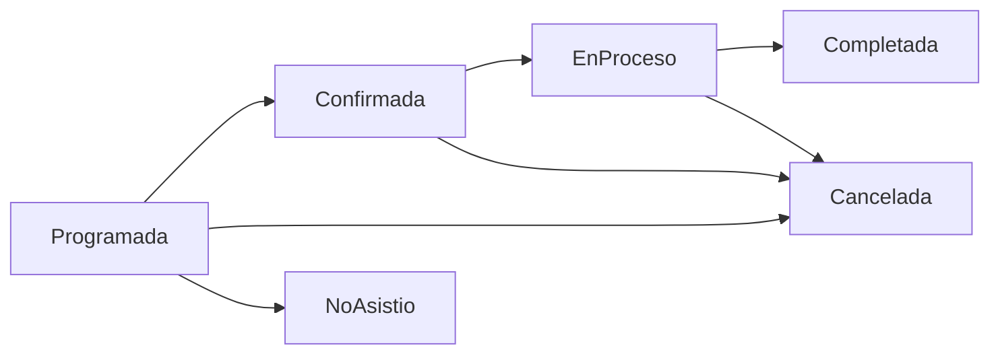

# API de Citas - Documentación

## Descripción General
El módulo de **Citas** gestiona el sistema de agendamiento de citas veterinarias, incluyendo la prevención de solapamiento de horarios, gestión de estados, y recordatorios automáticos.

---

## Endpoints

### 1. Obtener Todas las Citas
**Endpoint:** `GET /api/citas`

**Autorización:** Requerida (Token JWT)

**Descripción:** Retorna todas las citas registradas en el sistema.

**Respuesta Exitosa (200):**
```json
{
  "success": true,
  "message": "Citas obtenidas exitosamente",
  "data": [
    {
      "id": "guid",
      "fechaHora": "2024-01-15T10:00:00",
      "duracionMinutos": 30,
      "status": "Programada",
      "tipoConsulta": "Consulta General",
      "mascotaNombre": "Max",
      "veterinarioNombre": "Dr. González",
      "salaNombre": "Sala 1"
    }
  ]
}
```

**Códigos de Estado:**
- `200 OK` - Éxito
- `401 Unauthorized` - No autenticado
- `500 Internal Server Error` - Error del servidor

---

### 2. Obtener Cita por ID
**Endpoint:** `GET /api/citas/{id}`

**Autorización:** Requerida (Token JWT)

**Parámetros de Ruta:**
- `id` (Guid) - ID de la cita

**Respuesta Exitosa (200):**
```json
{
  "success": true,
  "data": {
    "id": "guid",
    "fechaHora": "2024-01-15T10:00:00",
    "duracionMinutos": 30,
    "status": "Programada",
    "tipoConsulta": "Consulta General",
    "motivo": "Revisión general",
    "notas": "Mascota con buen comportamiento",
    "mascota": {
      "id": "guid",
      "nombre": "Max",
      "especie": "Perro"
    },
    "veterinario": {
      "id": "guid",
      "nombre": "Dr. González"
    },
    "sala": {
      "id": "guid",
      "nombre": "Sala 1"
    },
    "historialEstados": [
      {
        "status": "Programada",
        "fechaCambio": "2024-01-10T09:00:00",
        "usuario": "Admin"
      }
    ]
  }
}
```

**Códigos de Estado:**
- `200 OK` - Cita encontrada
- `404 Not Found` - Cita no encontrada
- `401 Unauthorized` - No autenticado
- `500 Internal Server Error` - Error del servidor

---

### 3. Obtener Citas por Veterinario
**Endpoint:** `GET /api/citas/veterinario/{veterinarioId}`

**Autorización:** Requerida (Token JWT)

**Parámetros de Ruta:**
- `veterinarioId` (Guid) - ID del veterinario

**Parámetros de Query (Opcionales):**
- `startDate` (DateTime) - Fecha de inicio del rango
- `endDate` (DateTime) - Fecha de fin del rango

**Ejemplo de Uso:**
```
GET /api/citas/veterinario/12345678-1234-1234-1234-123456789012?startDate=2024-01-01&endDate=2024-01-31
```

**Respuesta Exitosa (200):**
```json
{
  "success": true,
  "data": [
    {
      "id": "guid",
      "fechaHora": "2024-01-15T10:00:00",
      "duracionMinutos": 30,
      "status": "Programada",
      "mascotaNombre": "Max"
    }
  ]
}
```

---

### 4. Obtener Citas por Mascota
**Endpoint:** `GET /api/citas/mascota/{mascotaId}`

**Autorización:** Requerida (Token JWT)

**Parámetros de Ruta:**
- `mascotaId` (Guid) - ID de la mascota

**Descripción:** Obtiene el historial completo de citas de una mascota específica.

---

### 5. Obtener Citas por Propietario
**Endpoint:** `GET /api/citas/propietario/{propietarioId}`

**Autorización:** Requerida (Token JWT)

**Parámetros de Ruta:**
- `propietarioId` (Guid) - ID del propietario

**Descripción:** Obtiene todas las citas de las mascotas de un propietario.

---

### 6. Obtener Citas por Rango de Fechas
**Endpoint:** `GET /api/citas/rango`

**Autorización:** Requerida (Token JWT)

**Parámetros de Query (Requeridos):**
- `startDate` (DateTime) - Fecha de inicio
- `endDate` (DateTime) - Fecha de fin

**Ejemplo de Uso:**
```
GET /api/citas/rango?startDate=2024-01-01T00:00:00&endDate=2024-01-31T23:59:59
```

---

### 7. Obtener Citas por Estado
**Endpoint:** `GET /api/citas/estado/{status}`

**Autorización:** Requerida (Token JWT)

**Parámetros de Ruta:**
- `status` (enum) - Estado de la cita

**Estados Disponibles:**
- `Programada` (0)
- `Confirmada` (1)
- `EnProceso` (2)
- `Completada` (3)
- `Cancelada` (4)
- `NoAsistio` (5)

**Ejemplo de Uso:**
```
GET /api/citas/estado/Programada
```

---

### 8. Crear Nueva Cita
**Endpoint:** `POST /api/citas`

**Autorización:** Requerida (Roles: Admin, Veterinario, Recepcionista)

**Cuerpo de la Solicitud:**
```json
{
  "mascotaId": "guid",
  "veterinarioId": "guid",
  "salaId": "guid",
  "fechaHora": "2024-01-15T10:00:00",
  "duracionMinutos": 30,
  "tipoConsulta": "Consulta General",
  "motivo": "Revisión anual",
  "notas": "Primera visita del año",
  "enviarRecordatorio": true
}
```

**Validaciones:**
- `mascotaId` - Requerido
- `veterinarioId` - Requerido
- `fechaHora` - Requerido, debe ser fecha futura
- `duracionMinutos` - Requerido, mínimo 15, máximo 240
- `tipoConsulta` - Requerido

**Respuesta Exitosa (201):**
```json
{
  "success": true,
  "message": "Cita creada exitosamente",
  "data": {
    "id": "guid",
    "fechaHora": "2024-01-15T10:00:00",
    "duracionMinutos": 30,
    "status": "Programada",
    "numeroTicket": "TICKET-20240115-001"
  }
}
```

**Códigos de Estado:**
- `201 Created` - Cita creada exitosamente
- `400 Bad Request` - Datos inválidos
- `401 Unauthorized` - No autenticado
- `403 Forbidden` - Sin permisos
- `409 Conflict` - Conflicto de horarios

**Errores Posibles:**
```json
{
  "success": false,
  "message": "El veterinario ya tiene una cita en ese horario",
  "errors": []
}
```

---

### 9. Actualizar Cita
**Endpoint:** `PUT /api/citas/{id}`

**Autorización:** Requerida (Roles: Admin, Veterinario, Recepcionista)

**Parámetros de Ruta:**
- `id` (Guid) - ID de la cita

**Cuerpo de la Solicitud:**
```json
{
  "veterinarioId": "guid",
  "salaId": "guid",
  "fechaHora": "2024-01-15T11:00:00",
  "duracionMinutos": 45,
  "tipoConsulta": "Cirugía Menor",
  "motivo": "Extracción dental",
  "notas": "Requiere anestesia local"
}
```

**Respuesta Exitosa (200):**
```json
{
  "success": true,
  "message": "Cita actualizada exitosamente",
  "data": {
    "id": "guid",
    "fechaHora": "2024-01-15T11:00:00",
    "status": "Programada"
  }
}
```

**Códigos de Estado:**
- `200 OK` - Actualización exitosa
- `400 Bad Request` - Datos inválidos
- `404 Not Found` - Cita no encontrada
- `409 Conflict` - Conflicto de horarios

---

### 10. Cancelar Cita
**Endpoint:** `PUT /api/citas/{id}/cancelar`

**Autorización:** Requerida (Roles: Admin, Veterinario, Recepcionista)

**Parámetros de Ruta:**
- `id` (Guid) - ID de la cita

**Cuerpo de la Solicitud:**
```json
{
  "motivo": "Cancelación por parte del cliente",
  "notas": "Reagendar para la próxima semana"
}
```

**Respuesta Exitosa (200):**
```json
{
  "success": true,
  "message": "Cita cancelada exitosamente",
  "data": {
    "id": "guid",
    "status": "Cancelada",
    "motivoCancelacion": "Cancelación por parte del cliente"
  }
}
```

**Códigos de Estado:**
- `200 OK` - Cancelación exitosa
- `400 Bad Request` - Datos inválidos
- `404 Not Found` - Cita no encontrada
- `409 Conflict` - Estado inválido para cancelación

---

### 11. Completar Cita
**Endpoint:** `PUT /api/citas/{id}/completar`

**Autorización:** Requerida (Roles: Admin, Veterinario)

**Parámetros de Ruta:**
- `id` (Guid) - ID de la cita

**Cuerpo de la Solicitud:**
```json
{
  "diagnostico": "Mascota en buen estado general",
  "tratamiento": "Continuar con alimentación balanceada",
  "proximaRevision": "2024-07-15T10:00:00",
  "notas": "Sin novedad"
}
```

**Respuesta Exitosa (200):**
```json
{
  "success": true,
  "message": "Cita completada exitosamente",
  "data": {
    "id": "guid",
    "status": "Completada",
    "diagnostico": "Mascota en buen estado general"
  }
}
```

---

### 12. Eliminar Cita
**Endpoint:** `DELETE /api/citas/{id}`

**Autorización:** Requerida (Rol: Admin únicamente)

**Parámetros de Ruta:**
- `id` (Guid) - ID de la cita

**Descripción:** Elimina permanentemente una cita del sistema. **Esta acción es irreversible.**

**Respuesta Exitosa (200):**
```json
{
  "success": true,
  "message": "Cita eliminada exitosamente",
  "data": null
}
```

**Códigos de Estado:**
- `200 OK` - Eliminación exitosa
- `404 Not Found` - Cita no encontrada
- `403 Forbidden` - Sin permisos de administrador

---

### 13. Verificar Disponibilidad
**Endpoint:** `GET /api/citas/disponibilidad`

**Autorización:** Requerida (Token JWT)

**Parámetros de Query:**
```
?veterinarioId=guid&fecha=2024-01-15&duracionMinutos=30
```

**Descripción:** Verifica horarios disponibles para un veterinario en una fecha específica, considerando el solapamiento de citas existentes.

**Respuesta Exitosa (200):**
```json
{
  "success": true,
  "data": {
    "disponible": true,
    "horariosDisponibles": [
      {
        "inicio": "2024-01-15T09:00:00",
        "fin": "2024-01-15T09:30:00"
      },
      {
        "inicio": "2024-01-15T10:00:00",
        "fin": "2024-01-15T10:30:00"
      },
      {
        "inicio": "2024-01-15T14:00:00",
        "fin": "2024-01-15T14:30:00"
      }
    ],
    "horariosOcupados": [
      {
        "inicio": "2024-01-15T11:00:00",
        "fin": "2024-01-15T12:00:00",
        "citaId": "guid",
        "mascota": "Luna"
      }
    ]
  }
}
```

---

## Lógica de Negocio

### Prevención de Solapamiento
El sistema verifica automáticamente:
1. **Disponibilidad del veterinario** - No puede tener dos citas al mismo tiempo
2. **Disponibilidad de la sala** - Una sala solo puede tener una cita activa
3. **Duración de la cita** - Se considera la hora de inicio + duración

**Algoritmo:**
```
CitaExistente.FechaHoraInicio < NuevaCita.FechaHoraFin
Y
CitaExistente.FechaHoraFin > NuevaCita.FechaHoraInicio
= CONFLICTO
```

### Estados de Cita



### Recordatorios Automáticos
- **24 horas antes:** Email y notificación push
- **2 horas antes:** SMS recordatorio
- **Job programado:** Se ejecuta cada hora para detectar citas próximas

---

## Ejemplos de Uso

### Ejemplo 1: Agendar Cita Completa
```bash
curl -X POST https://api.adopets.com/api/citas \
  -H "Authorization: Bearer {token}" \
  -H "Content-Type: application/json" \
  -d '{
    "mascotaId": "12345678-1234-1234-1234-123456789012",
    "veterinarioId": "87654321-4321-4321-4321-210987654321",
    "salaId": "11111111-1111-1111-1111-111111111111",
    "fechaHora": "2024-01-15T10:00:00",
    "duracionMinutos": 30,
    "tipoConsulta": "Consulta General",
    "motivo": "Control de vacunas",
    "enviarRecordatorio": true
  }'
```

### Ejemplo 2: Consultar Disponibilidad
```bash
curl -X GET "https://api.adopets.com/api/citas/disponibilidad?veterinarioId=87654321-4321-4321-4321-210987654321&fecha=2024-01-15&duracionMinutos=30" \
  -H "Authorization: Bearer {token}"
```

### Ejemplo 3: Cancelar Cita
```bash
curl -X PUT https://api.adopets.com/api/citas/12345678-1234-1234-1234-123456789012/cancelar \
  -H "Authorization: Bearer {token}" \
  -H "Content-Type: application/json" \
  -d '{
    "motivo": "Cliente canceló por viaje",
    "notas": "Contactar en 2 semanas"
  }'
```

---

## Notas Técnicas

### Consideraciones de Performance
- Las consultas por rango de fechas están optimizadas con índices en `FechaHora`
- El endpoint de disponibilidad puede ser intensivo, se recomienda cachear resultados
- Los recordatorios se procesan en background jobs

### Validaciones de Negocio
- No se pueden agendar citas en el pasado
- La duración mínima es 15 minutos, máxima 4 horas
- Los recordatorios solo se envían para citas confirmadas o programadas
- Al cancelar una cita, se libera automáticamente la sala y horario del veterinario

### Integración con Otros Módulos
- **Mascotas:** Valida que la mascota exista y esté activa
- **Usuarios (Veterinarios):** Valida que el usuario sea veterinario activo
- **Salas:** Valida disponibilidad de la sala
- **Tickets:** Al crear una cita, se puede generar automáticamente un ticket de procedimientos
- **Notificaciones:** Sistema de recordatorios automáticos

---

## Contacto y Soporte
**Desarrollador Responsable:** Developer 3 - Beto  
**Módulo:** Clínica & Historial Médico  
**Versión API:** 1.0  
**Última Actualización:** Enero 2024
