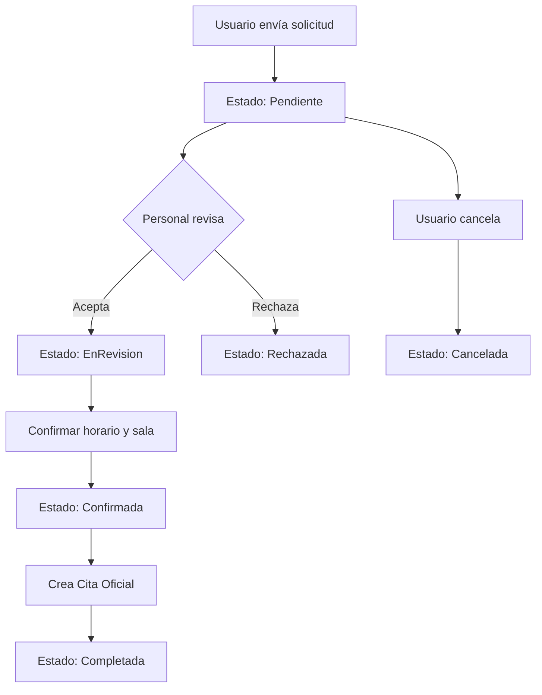

# API de Solicitudes de Citas Digitales - Documentación

## Descripción General
El módulo de **Solicitudes de Citas Digitales** permite a los usuarios solicitar citas en línea. El sistema implementa un flujo de aprobación donde las solicitudes son revisadas y confirmadas por el personal administrativo antes de convertirse en citas oficiales.

---

## Flujo del Sistema



---

## Endpoints

### 1. Crear Solicitud de Cita Digital
**Endpoint:** `POST /api/solicitudescitasdigitales`

**Autorización:** Requerida (Token JWT)

**Descripción:** Permite a un usuario autenticado solicitar una cita veterinaria en línea.

**Cuerpo de la Solicitud:**
```json
{
  "mascotaId": "guid",
  "tipoServicioId": "guid",
  "fechaPreferida": "2024-01-20T10:00:00",
  "horaPreferida": "10:00",
  "veterinarioPreferidoId": "guid",
  "motivo": "Revisión general y vacunación",
  "sintomas": "La mascota presenta decaimiento leve",
  "esUrgente": false,
  "telefonoContacto": "+52-555-123-4567",
  "emailContacto": "usuario@email.com"
}
```

**Validaciones:**
- `mascotaId` - Requerido, debe ser una mascota del usuario
- `tipoServicioId` - Requerido
- `fechaPreferida` - Requerido, debe ser fecha futura
- `motivo` - Requerido, máximo 500 caracteres
- `telefonoContacto` - Requerido
- `emailContacto` - Requerido, formato válido

**Respuesta Exitosa (200):**
```json
{
  "success": true,
  "message": "Solicitud creada exitosamente",
  "data": {
    "id": "guid",
    "numeroSolicitud": "SOL-20240115-001",
    "status": "Pendiente",
    "mascotaId": "guid",
    "mascotaNombre": "Max",
    "tipoServicio": "Consulta General",
    "fechaPreferida": "2024-01-20T10:00:00",
    "fechaSolicitud": "2024-01-15T14:30:00",
    "motivo": "Revisión general y vacunación",
    "esUrgente": false
  }
}
```

**Códigos de Estado:**
- `200 OK` - Solicitud creada exitosamente
- `400 Bad Request` - Datos inválidos
- `401 Unauthorized` - No autenticado
- `500 Internal Server Error` - Error del servidor

---

### 2. Obtener Solicitud por ID
**Endpoint:** `GET /api/solicitudescitasdigitales/{id}`

**Autorización:** Requerida (Token JWT)

**Parámetros de Ruta:**
- `id` (Guid) - ID de la solicitud

**Respuesta Exitosa (200):**
```json
{
  "success": true,
  "data": {
    "id": "guid",
    "numeroSolicitud": "SOL-20240115-001",
    "status": "Pendiente",
    "mascota": {
      "id": "guid",
      "nombre": "Max",
      "especie": "Perro",
      "raza": "Labrador"
    },
    "usuario": {
      "id": "guid",
      "nombre": "Juan Pérez",
      "email": "juan@email.com"
    },
    "tipoServicio": "Consulta General",
    "fechaPreferida": "2024-01-20T10:00:00",
    "horaPreferida": "10:00",
    "veterinarioPreferido": {
      "id": "guid",
      "nombre": "Dr. González"
    },
    "motivo": "Revisión general y vacunación",
    "sintomas": "La mascota presenta decaimiento leve",
    "esUrgente": false,
    "telefonoContacto": "+52-555-123-4567",
    "emailContacto": "usuario@email.com",
    "fechaSolicitud": "2024-01-15T14:30:00",
    "citaGeneradaId": null
  }
}
```

**Códigos de Estado:**
- `200 OK` - Solicitud encontrada
- `404 Not Found` - Solicitud no encontrada
- `401 Unauthorized` - No autenticado

---

### 3. Obtener Solicitudes por Usuario
**Endpoint:** `GET /api/solicitudescitasdigitales/usuario/{usuarioId}`

**Autorización:** Requerida (Token JWT)

**Parámetros de Ruta:**
- `usuarioId` (Guid) - ID del usuario

**Descripción:** Retorna todas las solicitudes de citas digitales de un usuario específico.

**Respuesta Exitosa (200):**
```json
{
  "success": true,
  "data": [
    {
      "id": "guid",
      "numeroSolicitud": "SOL-20240115-001",
      "status": "Confirmada",
      "mascotaNombre": "Max",
      "fechaPreferida": "2024-01-20T10:00:00",
      "fechaSolicitud": "2024-01-15T14:30:00"
    },
    {
      "id": "guid",
      "numeroSolicitud": "SOL-20240110-005",
      "status": "Completada",
      "mascotaNombre": "Luna",
      "fechaPreferida": "2024-01-18T15:00:00",
      "fechaSolicitud": "2024-01-10T09:15:00"
    }
  ]
}
```

---

### 4. Obtener Solicitudes Pendientes
**Endpoint:** `GET /api/solicitudescitasdigitales/pendientes`

**Autorización:** Requerida (Token JWT)

**Descripción:** Retorna todas las solicitudes pendientes de revisión. Útil para el personal administrativo.

**Respuesta Exitosa (200):**
```json
{
  "success": true,
  "data": [
    {
      "id": "guid",
      "numeroSolicitud": "SOL-20240115-001",
      "status": "Pendiente",
      "mascotaNombre": "Max",
      "usuarioNombre": "Juan Pérez",
      "fechaPreferida": "2024-01-20T10:00:00",
      "esUrgente": false,
      "fechaSolicitud": "2024-01-15T14:30:00"
    },
    {
      "id": "guid",
      "numeroSolicitud": "SOL-20240115-002",
      "status": "Pendiente",
      "mascotaNombre": "Bella",
      "usuarioNombre": "María García",
      "fechaPreferida": "2024-01-21T11:00:00",
      "esUrgente": true,
      "fechaSolicitud": "2024-01-15T16:00:00"
    }
  ]
}
```

**Ordenamiento:** Las solicitudes urgentes aparecen primero, luego por fecha de solicitud.

---

### 5. Verificar Disponibilidad
**Endpoint:** `POST /api/solicitudescitasdigitales/verificar-disponibilidad`

**Autorización:** Requerida (Token JWT)

**Descripción:** Verifica si hay disponibilidad para una fecha y hora específica antes de confirmar la solicitud.

**Cuerpo de la Solicitud:**
```json
{
  "veterinarioId": "guid",
  "salaId": "guid",
  "fechaHora": "2024-01-20T10:00:00",
  "duracionMinutos": 30
}
```

**Respuesta Exitosa (200):**
```json
{
  "success": true,
  "data": {
    "disponible": true,
    "veterinarioDisponible": true,
    "salaDisponible": true,
    "mensaje": "Horario disponible para la cita",
    "conflictos": []
  }
}
```

**Respuesta con Conflicto:**
```json
{
  "success": true,
  "data": {
    "disponible": false,
    "veterinarioDisponible": false,
    "salaDisponible": true,
    "mensaje": "El veterinario no está disponible en ese horario",
    "conflictos": [
      {
        "tipo": "Veterinario",
        "horarioOcupado": "2024-01-20T10:00:00 - 2024-01-20T11:00:00",
        "citaId": "guid"
      }
    ]
  }
}
```

---

### 6. Marcar Solicitud como En Revisión
**Endpoint:** `PUT /api/solicitudescitasdigitales/{id}/en-revision`

**Autorización:** Requerida (Roles: Admin, Recepcionista)

**Parámetros de Ruta:**
- `id` (Guid) - ID de la solicitud

**Descripción:** Marca la solicitud como "en revisión", indicando que el personal está trabajando en ella.

**Respuesta Exitosa (200):**
```json
{
  "success": true,
  "message": "Solicitud en revisión",
  "data": {
    "id": "guid",
    "numeroSolicitud": "SOL-20240115-001",
    "status": "EnRevision",
    "fechaRevision": "2024-01-15T16:00:00"
  }
}
```

---

### 7. Confirmar Solicitud
**Endpoint:** `POST /api/solicitudescitasdigitales/confirmar`

**Autorización:** Requerida (Roles: Admin, Recepcionista, Veterinario)

**Descripción:** Confirma la solicitud y crea automáticamente una cita oficial en el sistema.

**Cuerpo de la Solicitud:**
```json
{
  "solicitudId": "guid",
  "veterinarioId": "guid",
  "salaId": "guid",
  "fechaHoraConfirmada": "2024-01-20T10:00:00",
  "duracionMinutos": 30,
  "notasInternas": "Cliente prefiere veterinario especialista en cachorros"
}
```

**Validaciones:**
- Verifica disponibilidad de veterinario y sala
- Valida que la solicitud esté en estado "Pendiente" o "EnRevision"
- Crea la cita automáticamente

**Respuesta Exitosa (200):**
```json
{
  "success": true,
  "message": "Solicitud confirmada y cita creada",
  "data": {
    "id": "guid",
    "numeroSolicitud": "SOL-20240115-001",
    "status": "Confirmada",
    "citaGeneradaId": "guid",
    "fechaHoraConfirmada": "2024-01-20T10:00:00",
    "veterinario": "Dr. González",
    "sala": "Sala de Consulta 1"
  }
}
```

**Proceso Automático:**
1. Valida disponibilidad
2. Crea la cita en el sistema
3. Actualiza el estado de la solicitud a "Confirmada"
4. Envía notificación por email al usuario
5. Guarda el ID de la cita generada

---

### 8. Rechazar Solicitud
**Endpoint:** `POST /api/solicitudescitasdigitales/rechazar`

**Autorización:** Requerida (Roles: Admin, Recepcionista, Veterinario)

**Descripción:** Rechaza una solicitud de cita digital.

**Cuerpo de la Solicitud:**
```json
{
  "solicitudId": "guid",
  "motivoRechazo": "No hay disponibilidad en las fechas solicitadas",
  "sugerenciaAlternativa": "Le sugerimos agendar para la semana del 27 de enero"
}
```

**Respuesta Exitosa (200):**
```json
{
  "success": true,
  "message": "Solicitud rechazada",
  "data": {
    "id": "guid",
    "numeroSolicitud": "SOL-20240115-001",
    "status": "Rechazada",
    "motivoRechazo": "No hay disponibilidad en las fechas solicitadas",
    "fechaRechazo": "2024-01-15T17:00:00"
  }
}
```

**Proceso Automático:**
1. Actualiza estado a "Rechazada"
2. Guarda motivo del rechazo
3. Envía notificación por email al usuario con el motivo y sugerencias

---

### 9. Cancelar Solicitud (Usuario)
**Endpoint:** `PUT /api/solicitudescitasdigitales/{id}/cancelar`

**Autorización:** Requerida (Token JWT - Propietario de la solicitud)

**Parámetros de Ruta:**
- `id` (Guid) - ID de la solicitud

**Descripción:** Permite al usuario cancelar su propia solicitud antes de que sea confirmada.

**Respuesta Exitosa (200):**
```json
{
  "success": true,
  "message": "Solicitud cancelada",
  "data": {
    "id": "guid",
    "numeroSolicitud": "SOL-20240115-001",
    "status": "Cancelada",
    "fechaCancelacion": "2024-01-16T09:00:00"
  }
}
```

**Restricciones:**
- Solo el usuario propietario puede cancelar
- No se puede cancelar una solicitud ya confirmada o completada

---

## Estados de Solicitud

| Estado | Descripción | Acciones Permitidas |
|--------|-------------|---------------------|
| **Pendiente** | Solicitud recién creada | Ver, EnRevision, Rechazar, Cancelar |
| **EnRevision** | Personal revisando la solicitud | Ver, Confirmar, Rechazar, Cancelar |
| **Confirmada** | Solicitud aprobada, cita creada | Ver |
| **Rechazada** | Solicitud rechazada por personal | Ver |
| **Cancelada** | Usuario canceló la solicitud | Ver |
| **Completada** | Cita asociada fue completada | Ver |

---

## Lógica de Negocio

### Flujo de Aprobación

```typescript
// 1. Usuario crea solicitud
POST /api/solicitudescitasdigitales
  -> Estado: Pendiente
  -> Notificación a personal administrativo

// 2. Personal revisa
PUT /api/solicitudescitasdigitales/{id}/en-revision
  -> Estado: EnRevision

// 3a. Aprobación
POST /api/solicitudescitasdigitales/verificar-disponibilidad
  -> Verifica horarios
POST /api/solicitudescitasdigitales/confirmar
  -> Crea cita automáticamente
  -> Estado: Confirmada
  -> Notificación al usuario

// 3b. Rechazo
POST /api/solicitudescitasdigitales/rechazar
  -> Estado: Rechazada
  -> Notificación al usuario con motivo
```

### Sistema de Prioridad
- **Solicitudes Urgentes** (`esUrgente: true`) se muestran primero
- **Orden FIFO** para solicitudes no urgentes

### Validaciones Especiales
- Solo el propietario de la mascota puede crear solicitudes
- No se pueden crear solicitudes para fechas pasadas
- El usuario recibe notificaciones en cada cambio de estado

---

## Ejemplos de Uso

### Ejemplo 1: Usuario Solicita Cita
```bash
curl -X POST https://api.adopets.com/api/solicitudescitasdigitales \
  -H "Authorization: Bearer {user-token}" \
  -H "Content-Type: application/json" \
  -d '{
    "mascotaId": "12345678-1234-1234-1234-123456789012",
    "tipoServicioId": "87654321-4321-4321-4321-210987654321",
    "fechaPreferida": "2024-01-20T10:00:00",
    "horaPreferida": "10:00",
    "motivo": "Vacunación anual y chequeo general",
    "esUrgente": false,
    "telefonoContacto": "+52-555-123-4567",
    "emailContacto": "juan@email.com"
  }'
```

### Ejemplo 2: Recepcionista Confirma Solicitud
```bash
# Paso 1: Verificar disponibilidad
curl -X POST https://api.adopets.com/api/solicitudescitasdigitales/verificar-disponibilidad \
  -H "Authorization: Bearer {admin-token}" \
  -H "Content-Type: application/json" \
  -d '{
    "veterinarioId": "vet-guid",
    "salaId": "sala-guid",
    "fechaHora": "2024-01-20T10:00:00",
    "duracionMinutos": 30
  }'

# Paso 2: Confirmar
curl -X POST https://api.adopets.com/api/solicitudescitasdigitales/confirmar \
  -H "Authorization: Bearer {admin-token}" \
  -H "Content-Type: application/json" \
  -d '{
    "solicitudId": "solicitud-guid",
    "veterinarioId": "vet-guid",
    "salaId": "sala-guid",
    "fechaHoraConfirmada": "2024-01-20T10:00:00",
    "duracionMinutos": 30,
    "notasInternas": "Primera visita del mes"
  }'
```

### Ejemplo 3: Usuario Cancela Solicitud
```bash
curl -X PUT https://api.adopets.com/api/solicitudescitasdigitales/12345678-1234-1234-1234-123456789012/cancelar \
  -H "Authorization: Bearer {user-token}"
```

---

## Integración con Otros Módulos

### Módulo de Citas
- Al confirmar solicitud, se crea automáticamente una cita oficial
- El ID de la cita se guarda en `CitaGeneradaId`

### Módulo de Notificaciones
- Email al crear solicitud
- Email al confirmar/rechazar
- SMS para solicitudes urgentes

### Módulo de Mascotas
- Valida que la mascota exista y pertenezca al usuario

---

## Notas Técnicas

### Seguridad
- Los usuarios solo pueden ver sus propias solicitudes
- El personal administrativo puede ver todas las solicitudes
- Solo el propietario puede cancelar su solicitud

### Performance
- Listado de pendientes se cachea por 1 minuto
- Índices en `Status` y `FechaSolicitud`

### Notificaciones
- Email de confirmación incluye detalles de la cita
- Email de rechazo incluye motivo y sugerencias alternativas

---

## Contacto y Soporte
**Desarrollador Responsable:** Developer 3 - Beto  
**Módulo:** Clínica & Historial Médico  
**Versión API:** 1.0  
**Última Actualización:** Enero 2024
