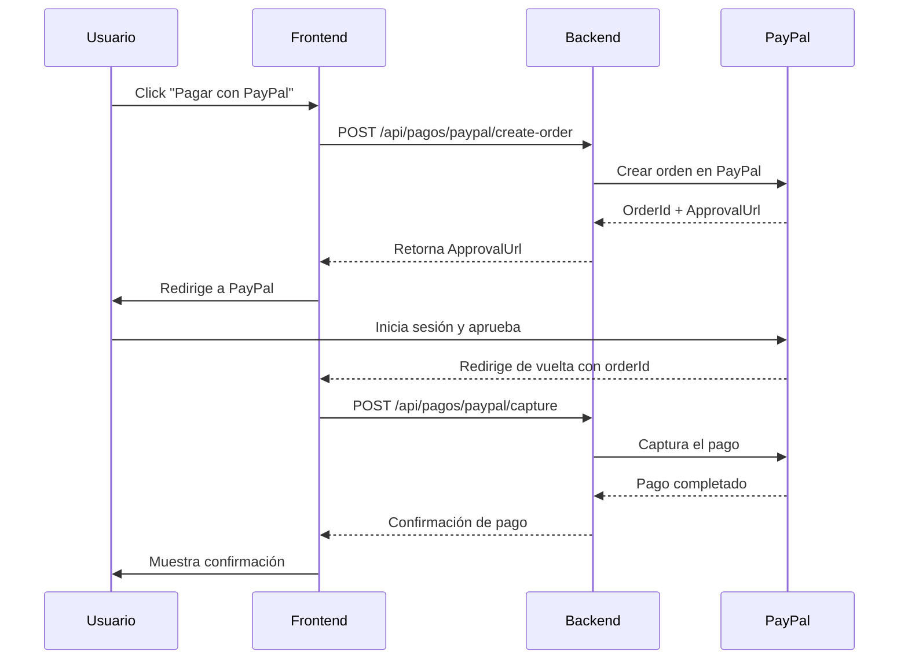

# API de Pagos con PayPal - Documentación

## Descripción General
El módulo de **Pagos** gestiona transacciones monetarias relacionadas con servicios veterinarios, integrándose con **PayPal** para procesamiento de pagos en línea. Soporta pagos completos y sistema de **anticipos del 50%** del costo total.

**? Actualizado con PayPalCheckoutSdk v1.0.4** - SDK moderno y compatible con .NET 9

---

## Características Principales
- ? Integración completa con **PayPalCheckoutSdk v1.0.4** (SDK más reciente)
- ? Soporte para anticipos (50% del total)
- ? Pagos completos (100%)
- ? Webhooks de PayPal para actualización automática
- ? Múltiples métodos de pago (PayPal, Efectivo, Tarjeta)
- ? Registro de estado de transacciones
- ? Cancelación de pagos
- ? Historial de pagos por usuario
- ? Compatible con .NET 9

---

## Métodos de Pago Soportados

| Método | Descripción | Requiere PayPal |
|--------|-------------|-----------------|
| **PayPal** | Pago en línea vía PayPal | ? Sí |
| **Efectivo** | Pago en efectivo en recepción | ? No |
| **TarjetaCredito** | Pago con tarjeta en terminal física | ? No |
| **TarjetaDebito** | Pago con débito en terminal física | ? No |
| **Transferencia** | Transferencia bancaria | ? No |

---

## Tipos de Pago

### 1. Anticipo (50%)
- El usuario paga el 50% del costo total al agendar la cita
- El saldo restante se paga al finalizar el servicio
- Ideal para servicios costosos (cirugías, hospitalizaciones)

### 2. Pago Completo (100%)
- El usuario paga el 100% por adelantado
- Típico para consultas generales y servicios menores

---

## Endpoints

### 1. Crear Pago (Método General)
**Endpoint:** `POST /api/pagos`

**Autorización:** Requerida (Token JWT)

**Descripción:** Crea un registro de pago con método tradicional (Efectivo, Tarjeta, Transferencia).

**Cuerpo de la Solicitud:**
```json
{
  "citaId": "guid",
  "monto": 609.00,
  "metodoPago": "Efectivo",
  "tipoPago": "Anticipo",
  "conceptoPago": "Anticipo 50% para cirugía de esterilización",
  "referencia": "REC-001",
  "notas": "Pago en efectivo en recepción"
}
```

**Validaciones:**
- `citaId` - Opcional (puede ser pago sin cita)
- `monto` - Requerido, mayor a 0
- `metodoPago` - Requerido (PayPal, Efectivo, TarjetaCredito, TarjetaDebito, Transferencia)
- `tipoPago` - Requerido (Anticipo, Completo)
- `conceptoPago` - Requerido, máximo 500 caracteres

**Respuesta Exitosa (200):**
```json
{
  "success": true,
  "message": "Pago creado exitosamente",
  "data": {
    "id": "guid",
    "folioPago": "PAGO-20240115-001",
    "fecha": "2024-01-15T14:30:00",
    "monto": 609.00,
    "metodoPago": "Efectivo",
    "tipoPago": "Anticipo",
    "status": "Completado",
    "conceptoPago": "Anticipo 50% para cirugía de esterilización",
    "referencia": "REC-001",
    "citaId": "guid",
    "usuarioId": "guid"
  }
}
```

**Códigos de Estado:**
- `200 OK` - Pago creado exitosamente
- `400 Bad Request` - Datos inválidos
- `401 Unauthorized` - No autenticado
- `500 Internal Server Error` - Error del servidor

---

### 2. Crear Orden de PayPal
**Endpoint:** `POST /api/pagos/paypal/create-order`

**Autorización:** Requerida (Token JWT)

**Descripción:** Crea una orden de pago en PayPal. Este es el primer paso para procesar un pago con PayPal.

**Cuerpo de la Solicitud:**
```json
{
  "citaId": "guid",
  "monto": 609.00,
  "tipoPago": "Anticipo",
  "conceptoPago": "Anticipo 50% para cirugía de esterilización",
  "descripcionDetallada": "Pago anticipado del 50% para procedimiento de esterilización programado para el 20/01/2024"
}
```

**Validaciones:**
- `monto` - Requerido, mínimo $1.00 USD
- `tipoPago` - Requerido (Anticipo o Completo)
- `conceptoPago` - Requerido

**Respuesta Exitosa (200):**
```json
{
  "success": true,
  "message": "Orden de PayPal creada exitosamente",
  "data": {
    "orderId": "PAYPAL-ORDER-123456789",
    "approvalUrl": "https://www.paypal.com/checkoutnow?token=EC-123456789",
    "status": "CREATED",
    "pagoId": "guid",
    "folioPago": "PAGO-20240115-001"
  }
}
```

**Proceso del Cliente:**
```
1. Frontend recibe approvalUrl
2. Redirige al usuario a PayPal
3. Usuario inicia sesión en PayPal
4. Usuario aprueba el pago
5. PayPal redirige de vuelta a la aplicación
6. Frontend captura el pago (siguiente endpoint)
```

**Códigos de Estado:**
- `200 OK` - Orden creada exitosamente
- `400 Bad Request` - Datos inválidos o error de PayPal
- `401 Unauthorized` - No autenticado
- `500 Internal Server Error` - Error del servidor o de PayPal

---

### 3. Capturar Pago de PayPal
**Endpoint:** `POST /api/pagos/paypal/capture`

**Autorización:** Requerida (Token JWT)

**Descripción:** Captura y finaliza un pago que fue aprobado por el usuario en PayPal.

**Cuerpo de la Solicitud:**
```json
{
  "orderId": "PAYPAL-ORDER-123456789"
}
```

**Respuesta Exitosa (200):**
```json
{
  "success": true,
  "message": "Pago capturado exitosamente",
  "data": {
    "id": "guid",
    "folioPago": "PAGO-20240115-001",
    "fecha": "2024-01-15T14:35:00",
    "monto": 609.00,
    "metodoPago": "PayPal",
    "tipoPago": "Anticipo",
    "status": "Completado",
    "paypalOrderId": "PAYPAL-ORDER-123456789",
    "paypalCaptureId": "CAPTURE-123456789",
    "conceptoPago": "Anticipo 50% para cirugía de esterilización",
    "emailPagador": "cliente@email.com",
    "nombrePagador": "Juan Pérez"
  }
}
```

**Estados Posibles:**
- `Completado` - Pago exitoso
- `Pendiente` - Pago en proceso
- `Fallido` - Pago rechazado

**Códigos de Estado:**
- `200 OK` - Pago capturado exitosamente
- `400 Bad Request` - OrderId inválido o pago no aprobado
- `401 Unauthorized` - No autenticado
- `500 Internal Server Error` - Error del servidor o de PayPal

---

### 4. Obtener Pago por ID
**Endpoint:** `GET /api/pagos/{id}`

**Autorización:** Requerida (Token JWT)

**Parámetros de Ruta:**
- `id` (Guid) - ID del pago

**Respuesta Exitosa (200):**
```json
{
  "success": true,
  "data": {
    "id": "guid",
    "folioPago": "PAGO-20240115-001",
    "fecha": "2024-01-15T14:30:00",
    "monto": 609.00,
    "metodoPago": "PayPal",
    "tipoPago": "Anticipo",
    "status": "Completado",
    "conceptoPago": "Anticipo 50% para cirugía de esterilización",
    "citaId": "guid",
    "usuario": {
      "id": "guid",
      "nombre": "Juan Pérez",
      "email": "juan@email.com"
    },
    "paypalOrderId": "PAYPAL-ORDER-123456789",
    "paypalCaptureId": "CAPTURE-123456789",
    "emailPagador": "cliente@email.com",
    "nombrePagador": "Juan Pérez",
    "notas": "Pago procesado correctamente",
    "fechaCancelacion": null,
    "motivoCancelacion": null
  }
}
```

---

### 5. Obtener Pago por PayPal Order ID
**Endpoint:** `GET /api/pagos/paypal/{orderId}`

**Autorización:** Requerida (Token JWT)

**Parámetros de Ruta:**
- `orderId` (string) - ID de orden de PayPal

**Descripción:** Busca un pago usando el OrderId de PayPal. Útil para validaciones y seguimiento.

---

### 6. Obtener Pagos por Usuario
**Endpoint:** `GET /api/pagos/usuario/{usuarioId}`

**Autorización:** Requerida (Token JWT)

**Parámetros de Ruta:**
- `usuarioId` (Guid) - ID del usuario

**Descripción:** Retorna el historial completo de pagos de un usuario.

**Respuesta Exitosa (200):**
```json
{
  "success": true,
  "data": [
    {
      "id": "guid",
      "folioPago": "PAGO-20240115-001",
      "fecha": "2024-01-15T14:30:00",
      "monto": 609.00,
      "metodoPago": "PayPal",
      "tipoPago": "Anticipo",
      "status": "Completado",
      "conceptoPago": "Anticipo 50% para cirugía"
    },
    {
      "id": "guid",
      "folioPago": "PAGO-20240110-015",
      "fecha": "2024-01-10T11:00:00",
      "monto": 500.00,
      "metodoPago": "Efectivo",
      "tipoPago": "Completo",
      "status": "Completado",
      "conceptoPago": "Consulta general"
    }
  ]
}
```

**Ordenamiento:** Por fecha descendente (más reciente primero)

---

### 7. Cancelar Pago
**Endpoint:** `PUT /api/pagos/{id}/cancelar`

**Autorización:** Requerida (Roles: Admin)

**Parámetros de Ruta:**
- `id` (Guid) - ID del pago

**Cuerpo de la Solicitud:**
```json
"Error en el monto capturado, se requiere reembolso"
```

**Descripción:** Cancela un pago existente. **Nota:** Este endpoint solo marca el pago como cancelado en el sistema, NO procesa reembolsos automáticos en PayPal.

**Respuesta Exitosa (200):**
```json
{
  "success": true,
  "message": "Pago cancelado",
  "data": {
    "id": "guid",
    "folioPago": "PAGO-20240115-001",
    "status": "Cancelado",
    "fechaCancelacion": "2024-01-16T10:00:00",
    "motivoCancelacion": "Error en el monto capturado, se requiere reembolso"
  }
}
```

**Restricciones:**
- Solo administradores pueden cancelar pagos
- Los reembolsos de PayPal deben procesarse manualmente desde el panel de PayPal

---

### 8. Webhook de PayPal
**Endpoint:** `POST /api/pagos/webhook/paypal`

**Autorización:** NO requerida (Endpoint público para PayPal)

**Descripción:** Recibe notificaciones automáticas de PayPal sobre cambios de estado en transacciones. Este endpoint es llamado directamente por PayPal.

**Eventos Soportados:**
- `PAYMENT.CAPTURE.COMPLETED` - Pago completado
- `PAYMENT.CAPTURE.DENIED` - Pago denegado
- `PAYMENT.CAPTURE.REFUNDED` - Pago reembolsado
- `CHECKOUT.ORDER.APPROVED` - Orden aprobada

**Cuerpo del Webhook (Ejemplo):**
```json
{
  "id": "WH-EVENT-123456789",
  "event_type": "PAYMENT.CAPTURE.COMPLETED",
  "resource": {
    "id": "CAPTURE-123456789",
    "status": "COMPLETED",
    "amount": {
      "currency_code": "USD",
      "value": "609.00"
    }
  }
}
```

**Proceso Automático:**
1. PayPal envía webhook
2. Sistema valida el webhook
3. Busca el pago asociado por OrderId
4. Actualiza el estado del pago
5. Envía notificación al usuario

**Respuesta:**
```
HTTP 200 OK
```

**Seguridad:**
- PayPal firma los webhooks con una clave secreta
- El sistema debe validar la firma antes de procesar
- Se recomienda usar IP whitelist para aceptar solo webhooks de PayPal

---

## Estados de Pago

| Estado | Descripción |
|--------|-------------|
| **Pendiente** | Pago iniciado pero no completado |
| **Completado** | Pago exitoso y verificado |
| **Fallido** | Pago rechazado o error |
| **Cancelado** | Pago anulado por administrador |
| **Reembolsado** | Pago devuelto al cliente |

---

## Flujo Completo de Pago con PayPal

### Flujo Frontend + Backend



---

## Sistema de Anticipos (50%)

### Cálculo de Anticipo
```javascript
// Ejemplo: Cirugía cuesta $1,218.00 total
const costoTotal = 1218.00;
const anticipo = costoTotal * 0.50; // $609.00
const saldoPendiente = costoTotal - anticipo; // $609.00
```

### Escenario Completo
```
1. Cliente agenda cita para cirugía ($1,218.00 total)
2. Paga anticipo del 50% ($609.00) con PayPal
3. El día de la cita, paga el saldo restante ($609.00)
4. Sistema registra ambos pagos vinculados a la misma cita
```

### Validación de Pagos Múltiples
```csharp
var pagosExistentes = GetPagosByCita(citaId);
var totalPagado = pagosExistentes.Sum(p => p.Monto);
var costoTotal = 1218.00m;
var saldoPendiente = costoTotal - totalPagado;

// Si saldoPendiente > 0, aún hay deuda
// Si saldoPendiente == 0, está pagado completamente
```

---

## Integración con PayPal SDK

### ? SDK Moderno - PayPalCheckoutSdk v1.0.4

**Instalado y Configurado:**
```xml
<PackageReference Include="PayPalCheckoutSdk" Version="1.0.4" />
<PackageReference Include="PayPalHttp" Version="1.0.1" />
```

### Configuración (appsettings.json)
```json
{
  "PayPal": {
    "Mode": "sandbox",
    "ClientId": "your-paypal-client-id",
    "ClientSecret": "your-paypal-client-secret"
  }
}
```

### Inicialización del SDK (Moderno)
```csharp
using PayPalCheckoutSdk.Core;
using PayPalCheckoutSdk.Orders;

// Configurar ambiente según el modo
PayPalEnvironment environment = settings.Mode == "live"
    ? new LiveEnvironment(clientId, clientSecret)
    : new SandboxEnvironment(clientId, clientSecret);

// Crear cliente HTTP de PayPal
var client = new PayPalHttpClient(environment);
```

### Crear Orden (Moderno)
```csharp
var orderRequest = new OrderRequest
{
    CheckoutPaymentIntent = "CAPTURE",
    PurchaseUnits = new List<PurchaseUnitRequest>
    {
        new PurchaseUnitRequest
        {
            AmountWithBreakdown = new AmountWithBreakdown
            {
                CurrencyCode = "MXN",
                Value = "609.00"
            },
            Description = "Anticipo 50% para cirugía de esterilización"
        }
    },
    ApplicationContext = new ApplicationContext
    {
        ReturnUrl = "https://app.adopets.com/payment/success",
        CancelUrl = "https://app.adopets.com/payment/cancel",
        BrandName = "AdoPets",
        LandingPage = "BILLING",
        UserAction = "PAY_NOW"
    }
};

var request = new OrdersCreateRequest();
request.Prefer("return=representation");
request.RequestBody(orderRequest);

var response = await client.Execute(request);
var order = response.Result<Order>();
```

### Capturar Orden (Moderno)
```csharp
var request = new OrdersCaptureRequest(orderId);
request.Prefer("return=representation");
request.RequestBody(new OrderActionRequest());

var response = await client.Execute(request);
var order = response.Result<Order>();

// Extraer información del pago capturado
var capture = order.PurchaseUnits?.FirstOrDefault()?.Payments?.Captures?.FirstOrDefault();
var captureId = capture?.Id;
var payerEmail = order.Payer?.Email;
var payerName = order.Payer?.Name?.GivenName + " " + order.Payer?.Name?.Surname;
```

### Ventajas del Nuevo SDK

| Característica | SDK Antiguo | SDK Moderno (Actual) |
|----------------|-------------|----------------------|
| Paquete | PayPal 1.9.1 | PayPalCheckoutSdk 1.0.4 |
| Async/Await | ? No nativo | ? Nativo |
| .NET 9 | ?? Sin garantía | ? Compatible |
| Performance | ?? Regular | ? Optimizado |
| Mantenimiento | ? Deprecado | ? Activo |
| Documentación | ?? Antigua | ? Actualizada |

---

## Documentación Adicional

### ?? Guías Específicas de PayPal:

1. **[PAYPAL_SETUP_GUIDE.md](./PAYPAL_SETUP_GUIDE.md)**
   - Guía paso a paso para obtener credenciales
   - Configuración de cuentas sandbox
   - Mejores prácticas de seguridad

2. **[PAYPAL_SDK_UPDATE.md](./PAYPAL_SDK_UPDATE.md)** ? NUEVO
   - Información del SDK moderno
   - Comparación SDK antiguo vs nuevo
   - Guía de migración

3. **[PAYPAL_API_TESTS.md](./PAYPAL_API_TESTS.md)**
   - Colección completa de pruebas
   - Ejemplos de request/response
   - Configuración de Postman

4. **[PAYPAL_FRONTEND_EXAMPLES.md](./PAYPAL_FRONTEND_EXAMPLES.md)**
   - Componentes React/TypeScript
   - Hook usePayPal
   - Integración completa

---

## Contacto y Soporte
**Desarrollador Responsable:** Developer 3 - Beto  
**Módulo:** Clínica & Historial Médico  
**Versión API:** 1.0  
**Última Actualización:** Enero 2024  
**PayPal SDK:** PayPalCheckoutSdk v1.0.4 (Moderno) ?
