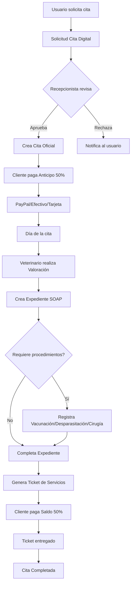

# Documentación Completa - Módulos de Clínica & Historial Médico

## ?? Índice de Documentación

Este directorio contiene la documentación completa de los módulos desarrollados por **Developer 3 (Beto)** - Clinic & Medical Records Lead.

---

## ?? Estructura de Documentos

### 1. [Citas API](./01-Citas-API.md)
**Módulo:** Sistema de Agendamiento de Citas  
**Prioridad:** Alta  
**Complejidad:** Media-Alta

**Funcionalidades:**
- ? Agendamiento de citas con prevención de solapamiento
- ? Gestión de estados de citas (Programada, Confirmada, EnProceso, Completada, Cancelada)
- ? Consultas por veterinario, mascota, propietario, fecha y estado
- ? Sistema de disponibilidad de horarios
- ? Recordatorios automáticos (email, push, SMS)
- ? Historial de cambios de estado
- ? Citas para mascotas del refugio y externas

**Endpoints Principales:**
- `GET/POST /api/citas` - CRUD completo
- `GET /api/citas/disponibilidad` - Verificar horarios disponibles
- `PUT /api/citas/{id}/cancelar` - Cancelar cita
- `PUT /api/citas/{id}/completar` - Completar cita

---

### 2. [Salas API](./02-Salas-API.md)
**Módulo:** Gestión de Salas de Atención  
**Prioridad:** Media  
**Complejidad:** Baja-Media

**Funcionalidades:**
- ? Registro de salas (Consulta, Cirugía, Emergencia, Hospitalización, Diagnóstico, Laboratorio)
- ? Control de disponibilidad de salas
- ? Gestión de equipamiento por sala
- ? Soft delete para preservar historial
- ? Estados: Disponible, Ocupada, Mantenimiento, Reservada

**Endpoints Principales:**
- `GET /api/salas` - Listar todas las salas
- `GET /api/salas/activas` - Solo salas activas
- `POST /api/salas` - Crear nueva sala (Admin)
- `PUT /api/salas/{id}` - Actualizar sala (Admin)
- `DELETE /api/salas/{id}` - Soft delete (Admin)

---

### 3. [Solicitudes de Citas Digitales API](./03-SolicitudesCitasDigitales-API.md)
**Módulo:** Sistema de Citas en Línea  
**Prioridad:** Alta  
**Complejidad:** Media

**Funcionalidades:**
- ? Solicitudes de citas en línea por usuarios
- ? Flujo de aprobación (Pendiente ? EnRevisión ? Confirmada/Rechazada)
- ? Verificación de disponibilidad antes de confirmar
- ? Priorización de solicitudes urgentes
- ? Conversión automática a cita oficial al confirmar
- ? Notificaciones por email en cada cambio de estado

**Endpoints Principales:**
- `POST /api/solicitudescitasdigitales` - Crear solicitud
- `GET /api/solicitudescitasdigitales/pendientes` - Ver pendientes
- `POST /api/solicitudescitasdigitales/verificar-disponibilidad` - Verificar horarios
- `POST /api/solicitudescitasdigitales/confirmar` - Confirmar y crear cita
- `POST /api/solicitudescitasdigitales/rechazar` - Rechazar solicitud

---

### 4. [Tickets API](./04-Tickets-API.md)
**Módulo:** Sistema de Tickets de Procedimientos  
**Prioridad:** Alta  
**Complejidad:** Media

**Funcionalidades:**
- ? Generación de tickets de servicios/procedimientos
- ? Cálculo automático de subtotal, IVA, descuentos y total
- ? Generación de PDF usando **QuestPDF**
- ? Múltiples detalles por ticket (itemizado)
- ? Control de estado de entrega
- ? Búsqueda por número de ticket
- ? Historial por cliente

**Endpoints Principales:**
- `POST /api/tickets` - Crear nuevo ticket
- `GET /api/tickets/{id}` - Obtener ticket
- `GET /api/tickets/numero/{numeroTicket}` - Buscar por número
- `GET /api/tickets/cliente/{clienteId}` - Historial del cliente
- `PUT /api/tickets/{id}/entregar` - Marcar como entregado
- `GET /api/tickets/{id}/pdf` - Descargar PDF

---

### 5. [Pagos con PayPal API](./05-Pagos-PayPal-API.md)
**Módulo:** Sistema de Pagos Integrado con PayPal  
**Prioridad:** Alta  
**Complejidad:** Alta  
**Estado:** ? Implementado y Listo  
**SDK:** PayPalCheckoutSdk v1.0.4 (Moderno) ?

**Funcionalidades:**
- ? Integración completa con **PayPalCheckoutSdk v1.0.4** (SDK más reciente)
- ? Sistema de **anticipos del 50%** del costo total
- ? Soporte para múltiples métodos de pago (PayPal, Efectivo, Tarjeta, Transferencia)
- ? Webhooks de PayPal para actualización automática
- ? Registro de transacciones con estados (Pendiente, Completado, Fallido, Cancelado)
- ? Historial de pagos por usuario
- ? Generación de folios únicos
- ? Compatible con .NET 9

**Endpoints Principales:**
- `POST /api/pagos` - Crear pago manual (Efectivo/Tarjeta)
- `POST /api/pagos/paypal/create-order` - Crear orden de PayPal
- `POST /api/pagos/paypal/capture` - Capturar pago de PayPal
- `GET /api/pagos/{id}` - Consultar pago
- `GET /api/pagos/usuario/{usuarioId}` - Historial de pagos
- `PUT /api/pagos/{id}/cancelar` - Cancelar pago (Admin)
- `POST /api/pagos/webhook/paypal` - Webhook de PayPal

**Tipos de Pago:**
- **Anticipo (50%):** Pago parcial al agendar
- **Completo (100%):** Pago total por adelantado

**?? Guías Adicionales de PayPal:**
- **[Guía de Configuración de PayPal](./PAYPAL_SETUP_GUIDE.md)** - Paso a paso para obtener credenciales y configurar
- **[Actualización del SDK](./PAYPAL_SDK_UPDATE.md)** ? NUEVO - Información del SDK moderno (v1.0.4)
- **[Pruebas del API de PayPal](./PAYPAL_API_TESTS.md)** - Colección completa de pruebas con ejemplos
- **[Ejemplos Frontend](./PAYPAL_FRONTEND_EXAMPLES.md)** - Componentes React/TypeScript listos para usar
- **[Resumen Final](./PAYPAL_SDK_FINAL_SUMMARY.md)** - Estado actual y checklist completo

---

### 6. [Expedientes Médicos API](./06-Expedientes-API.md)
**Módulo:** Historial Clínico con Metodología SOAP  
**Prioridad:** Alta  
**Complejidad:** Alta

**Funcionalidades:**
- ? Registro de expedientes médicos con metodología **SOAP**
  - **S (Subjetivo):** Síntomas reportados por el propietario
  - **O (Objetivo):** Hallazgos del examen físico
  - **A (Análisis):** Diagnóstico del veterinario
  - **P (Plan):** Tratamiento y seguimiento
- ? Adjuntos médicos (Rayos X, análisis, ecografías, imágenes)
- ? Generación automática de número de expediente
- ? Historial completo por mascota
- ? Vinculación con citas
- ? Registro de próxima revisión

**Endpoints Principales:**
- `GET /api/expedientes/{id}` - Obtener expediente
- `GET /api/expedientes/mascota/{mascotaId}` - Historial de mascota
- `POST /api/expedientes` - Crear expediente (Veterinario)
- `DELETE /api/expedientes/{id}` - Eliminar (Admin)
- `POST /api/expedientes/{id}/adjuntos` - Agregar adjunto médico
- `DELETE /api/expedientes/adjuntos/{adjuntoId}` - Eliminar adjunto

**Tipos de Adjuntos:**
- RayoX, Ecografía, Análisis, Imagen, Documento, Otro

---

### 7. [Historial Clínico Complementario API](./07-HistorialClinico-Complementario-API.md)
**Módulo:** Vacunaciones, Desparasitaciones, Cirugías y Valoraciones  
**Prioridad:** Alta  
**Complejidad:** Media-Alta

#### ?? Vacunaciones
**Funcionalidades:**
- ? Registro de vacunas aplicadas
- ? Plan de refuerzos automático
- ? Alertas de próximas vacunas (30, 15 días antes)
- ? Historial completo de vacunación

**Endpoints:**
- `GET/POST /api/vacunaciones`
- `GET /api/vacunaciones/mascota/{mascotaId}`
- `GET /api/vacunaciones/proximas?days=30`

#### ?? Desparasitaciones
**Funcionalidades:**
- ? Control de desparasitación interna y externa
- ? Registro de producto, dosis y fechas
- ? Alertas de próximas desparasitaciones
- ? Detección de efectos adversos

**Endpoints:**
- `GET/POST /api/desparasitaciones`
- `GET /api/desparasitaciones/mascota/{mascotaId}`
- `GET /api/desparasitaciones/proximas?days=30`

#### ?? Cirugías
**Funcionalidades:**
- ? Registro completo de procedimientos quirúrgicos
- ? Detalles de anestesia y duración
- ? Control de complicaciones
- ? Instrucciones post-operatorias
- ? Fechas de revisión y retiro de puntos

**Endpoints:**
- `GET/POST /api/cirugias`
- `GET /api/cirugias/mascota/{mascotaId}`
- `GET /api/cirugias/veterinario/{veterinarioId}`

#### ?? Valoraciones
**Funcionalidades:**
- ? Registro de signos vitales (peso, temperatura, FC, FR)
- ? Evaluación de condición corporal
- ? Estado mental y mucosas
- ? Tracking de parámetros en el tiempo
- ? Última valoración rápida

**Endpoints:**
- `GET/POST /api/valoraciones`
- `GET /api/valoraciones/mascota/{mascotaId}`
- `GET /api/valoraciones/mascota/{mascotaId}/ultima`

---

## ?? Integración entre Módulos

### Flujo Completo de Atención Veterinaria

---

## ?? Estadísticas de Desarrollo

### Resumen del Módulo

| Métrica | Valor |
|---------|-------|
| **Total de Endpoints** | ~80+ endpoints |
| **Controladores** | 10 controladores principales |
| **Entidades** | 14 entidades core |
| **Integraciones Externas** | PayPal SDK, QuestPDF |
| **Métodos de Pago** | 5 (PayPal, Efectivo, 2 tarjetas, Transferencia) |
| **Tipos de Adjuntos** | 6 tipos |
| **Estados de Cita** | 6 estados |
| **Estados de Pago** | 5 estados |

---

## ??? Seguridad y Permisos

### Roles y Permisos

| Acción | Admin | Veterinario | Recepcionista | Usuario |
|--------|-------|-------------|---------------|---------|
| Ver citas | ? | ? | ? | ? (propias) |
| Crear citas | ? | ? | ? | ? |
| Cancelar citas | ? | ? | ? | ? |
| Completar citas | ? | ? | ? | ? |
| Gestionar salas | ? | ? | ? | ? |
| Crear expedientes | ? | ? | ? | ? |
| Ver expedientes | ? | ? | ? | ? |
| Registrar vacunas | ? | ? | ? | ? |
| Crear tickets | ? | ? | ? | ? |
| Procesar pagos | ? | ? | ? | ? |
| Cancelar pagos | ? | ? | ? | ? |

---

## ?? Características Técnicas Destacadas

### 1. Sistema de Prevención de Conflictos
- Algoritmo de detección de solapamiento de horarios
- Validación en tiempo real de disponibilidad de veterinarios y salas
- Bloqueo optimista para evitar race conditions

### 2. Integración con PayPal
- OAuth 2.0 para autenticación
- Webhooks para actualización automática
- Soporte para Sandbox y Producción
- Manejo de errores robusto

### 3. Generación de PDFs
- QuestPDF para tickets profesionales
- Templates personalizables
- Optimización para impresión térmica
- Logos y branding incluidos

### 4. Metodología SOAP Médica
- Estándar internacional de documentación clínica
- Campos estructurados para mejor análisis
- Integración con adjuntos médicos
- Trazabilidad completa

### 5. Sistema de Alertas
- Recordatorios de citas (24h, 2h antes)
- Alertas de vacunas próximas a vencer
- Alertas de desparasitaciones pendientes
- Notificaciones de pagos

---

## ?? Soporte y Contacto

**Desarrollador Responsable:** Developer 3 - Beto  
**Módulo:** Clinic & Medical Records Lead  
**Email:** beto@adopets.com  
**Versión:** 1.0  
**Framework:** .NET 9  
**Última Actualización:** Enero 2024

---

## ?? Notas de Versionado

### Versión 1.0 (Enero 2024)
- ? Implementación completa de módulo de Citas
- ? Sistema de Salas
- ? Solicitudes de Citas Digitales
- ? Sistema de Tickets con PDF
- ? Integración con PayPal
- ? Expedientes Médicos SOAP
- ? Vacunaciones con alertas
- ? Desparasitaciones con alertas
- ? Registro de Cirugías
- ? Valoraciones de signos vitales

### Próximas Funcionalidades (Roadmap)
- ?? Dashboard de estadísticas por veterinario
- ?? Reportes de ingresos por servicio
- ?? Integración con recordatorios por WhatsApp
- ?? Sistema de recetas médicas digitales
- ?? Firma digital de documentos médicos
- ?? Exportación de expedientes a PDF completo

---

## ?? Referencias Rápidas

### Formato de Folios
- **Citas:** No tienen folio específico (usan GUID)
- **Expedientes:** `EXP-YYYYMMDD-XXX` (Ej: EXP-20240115-001)
- **Tickets:** `TICKET-YYYYMMDD-XXX` (Ej: TICKET-20240115-001)
- **Pagos:** `PAGO-YYYYMMDD-XXX` (Ej: PAGO-20240115-001)
- **Solicitudes:** `SOL-YYYYMMDD-XXX` (Ej: SOL-20240115-001)

### Códigos HTTP Estándar
- `200 OK` - Operación exitosa
- `201 Created` - Recurso creado exitosamente
- `400 Bad Request` - Datos inválidos
- `401 Unauthorized` - No autenticado
- `403 Forbidden` - Sin permisos
- `404 Not Found` - Recurso no encontrado
- `409 Conflict` - Conflicto de recursos (ej: horarios)
- `500 Internal Server Error` - Error del servidor

---

## ?? Recursos Adicionales

- [Documentación Principal del Proyecto](../README.md)
- [Diseño de Base de Datos](../DatabaseDesign.md)
- [Estructura del Proyecto](../ProjectStructure.md)
- [Guía de Autenticación](../AUTHENTICATION_README.md)
- [Ejemplos de API](../API_EXAMPLES.md)

---

**¡Gracias por utilizar AdoPets Backend!** ??

Si tienes dudas o sugerencias, no dudes en contactar al equipo de desarrollo.
