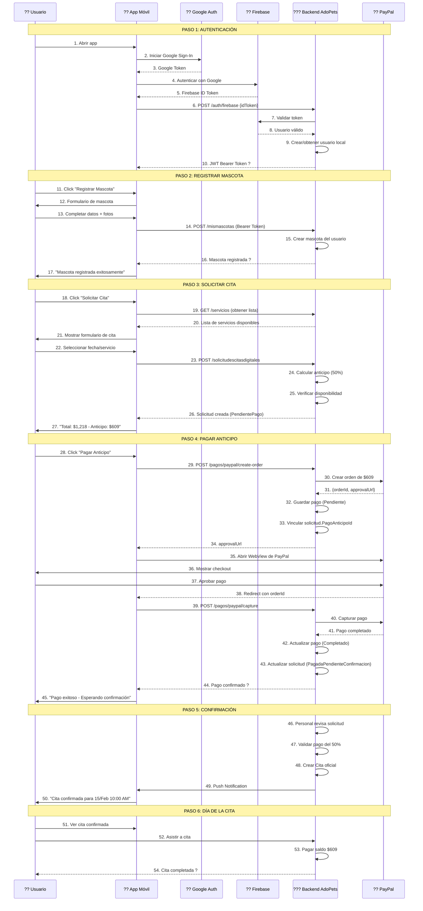
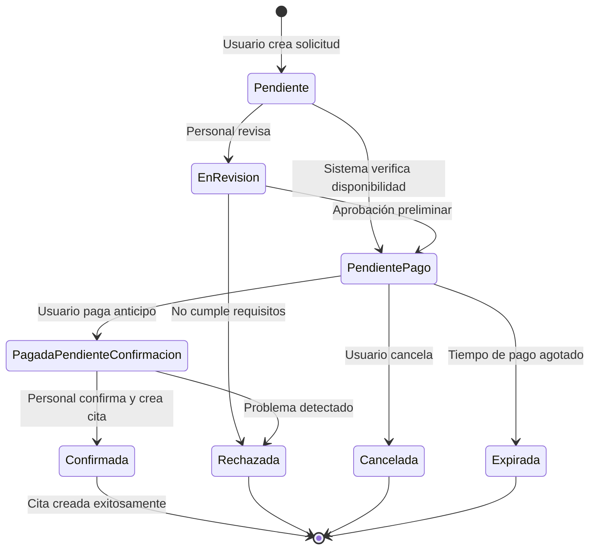

# ?? Guía de Implementación - Proceso de Citas para Adoptantes (App Móvil)

## ?? Índice
1. [Visión General](#visión-general)
2. [Flujo Completo](#flujo-completo)
3. [Autenticación](#1-autenticación)
4. [Registro de Mascotas](#2-registro-de-mascotas)
5. [Solicitud de Cita](#3-solicitud-de-cita)
6. [Pago del Anticipo](#4-pago-del-anticipo)
7. [Seguimiento de Solicitud](#5-seguimiento-de-solicitud)
8. [Estados y Notificaciones](#estados-y-notificaciones)
9. [Manejo de Errores](#manejo-de-errores)
10. [Ejemplos de Código](#ejemplos-de-código)

---

## Visión General

El sistema permite que los **adoptantes** (usuarios con mascotas propias) puedan:
- ? Registrar sus mascotas en el sistema
- ? Solicitar citas veterinarias en línea
- ? Pagar el 50% de anticipo mediante PayPal
- ? Hacer seguimiento del estado de sus solicitudes
- ? Pagar el saldo restante el día de la cita

### Requisitos Previos
- Usuario autenticado con Google/Firebase
- Token JWT del backend de AdoPets
- Mascota registrada en el sistema
- Método de pago PayPal configurado

---

## Flujo Completo



---

## 1. Autenticación

### ?? Flujo de Autenticación con Firebase

El sistema utiliza **autenticación híbrida**:
- **Frontend:** Google Sign-In ? Firebase Authentication
- **Backend:** Firebase valida token ? Genera JWT propio

### Endpoint de Autenticación

```http
POST /api/v1/auth/firebase
Content-Type: application/json

{
  "idToken": "eyJhbGciOi...[Firebase ID Token]",
  "deviceInfo": "Android 13 - Pixel 7"  // Opcional
}
```

### Respuesta Exitosa (200 OK)

```json
{
  "success": true,
  "message": "Autenticación con Firebase exitosa",
  "data": {
    "accessToken": "eyJhbGciOi...[JWT Bearer del Backend]",
    "refreshToken": "550e8400-e29b-41d4-a716-446655440000",
    "expiresIn": 3600,
    "usuario": {
      "id": "123e4567-e89b-12d3-a456-426614174000",
      "nombre": "Juan",
      "apellidoPaterno": "Pérez",
      "apellidoMaterno": "García",
      "nombreCompleto": "Juan Pérez García",
      "email": "juan.perez@gmail.com",
      "telefono": null,
      "estatus": 1,
      "ultimoAccesoAt": "2024-01-15T14:30:00Z",
      "roles": ["Adoptante"],
      "tienePoliticasAceptadas": true,
      "createdAt": "2024-01-15T14:30:00Z"
    }
  }
}
```

### ?? Importante

1. **Guardar el `accessToken`** en almacenamiento seguro (Keychain/Keystore)
2. **Usar el token en TODAS las peticiones** subsecuentes:
   ```
   Authorization: Bearer eyJhbGciOi...
   ```
3. El token expira en **1 hora** (3600 segundos)
4. Si el usuario no existe, **se crea automáticamente** con rol "Adoptante"

### Errores Comunes

| Código | Error | Solución |
|--------|-------|----------|
| 401 | Token de Firebase inválido | Renovar Firebase ID Token |
| 401 | Token expirado | Volver a autenticar |
| 403 | Usuario bloqueado | Contactar soporte |

---

## 2. Registro de Mascotas

### ?? Antes de Solicitar una Cita

**Requisito:** El usuario debe tener **al menos una mascota registrada** en el sistema.

### Endpoint: Listar Mis Mascotas

```http
GET /api/mismascotas
Authorization: Bearer {token}
```

**Respuesta:**
```json
{
  "success": true,
  "data": [
    {
      "id": "mascota-guid",
      "nombre": "Max",
      "especie": "Perro",
      "raza": "Labrador",
      "fechaNacimiento": "2020-05-15",
      "sexo": 1,
      "edadEnAnios": 3,
      "personalidad": "Juguetón y amigable",
      "estadoSalud": "Saludable, todas las vacunas al día",
      "fotos": [
        {
          "storageKey": "/uploads/mascotas-usuario/guid/foto1.jpg",
          "mimeType": "image/jpeg",
          "orden": 1,
          "esPrincipal": true
        }
      ]
    }
  ]
}
```

### Endpoint: Registrar Nueva Mascota

```http
POST /api/mismascotas
Authorization: Bearer {token}
Content-Type: application/json

{
  "nombre": "Max",
  "especie": "Perro",
  "raza": "Labrador",
  "fechaNacimiento": "2020-05-15",
  "sexo": 1,
  "personalidad": "Juguetón, amigable con niños y otros perros",
  "estadoSalud": "Saludable. Todas las vacunas al día",
  "notas": "Le gusta correr en el parque"
}
```

**Valores de `sexo`:**
- `1` = Macho
- `2` = Hembra

**Respuesta (201 Created):**
```json
{
  "success": true,
  "message": "Mascota registrada exitosamente",
  "data": {
    "id": "mascota-guid",
    "nombre": "Max",
    "especie": "Perro",
    "raza": "Labrador",
    "fechaNacimiento": "2020-05-15T00:00:00Z",
    "sexo": 1,
    "edadEnAnios": 3,
    "personalidad": "Juguetón, amigable con niños y otros perros",
    "estadoSalud": "Saludable. Todas las vacunas al día",
    "propietarioId": "usuario-guid",
    "fotos": [],
    "createdAt": "2024-01-15T14:35:00Z"
  }
}
```

### Endpoint: Agregar Fotos a Mascota

```http
POST /api/mismascotas/{mascotaId}/fotos
Authorization: Bearer {token}
Content-Type: application/json

[
  {
    "storageKey": "data:image/jpeg;base64,/9j/4AAQSkZJRg...",
    "mimeType": "image/jpeg",
    "orden": 1,
    "esPrincipal": true,
    "uploadedAt": "2024-01-15T14:40:00Z"
  }
]
```

**Notas sobre fotos:**
- Formato: Base64 o data URI
- Tamaño máximo recomendado: 5MB
- El backend redimensiona automáticamente a 1600px
- Se guardan como JPEG con calidad 75%

---

## 3. Solicitud de Cita

### ?? Crear Solicitud de Cita

### Paso 1: Obtener Servicios Disponibles

```http
GET /api/servicios
Authorization: Bearer {token}
```

**Respuesta:**
```json
{
  "success": true,
  "data": [
    {
      "id": "servicio-guid-1",
      "descripcion": "Consulta General",
      "categoria": 1,
      "duracionMinDefault": 30,
      "precioSugerido": 500.00,
      "activo": true
    },
    {
      "id": "servicio-guid-2",
      "descripcion": "Vacunación",
      "categoria": 2,
      "duracionMinDefault": 20,
      "precioSugerido": 350.00,
      "activo": true
    },
    {
      "id": "servicio-guid-3",
      "descripcion": "Esterilización",
      "categoria": 3,
      "duracionMinDefault": 120,
      "precioSugerido": 1500.00,
      "activo": true
    }
  ]
}
```

### Paso 2: Crear Solicitud

```http
POST /api/solicitudescitasdigitales
Authorization: Bearer {token}
Content-Type: application/json

{
  "solicitanteId": "usuario-guid",
  "mascotaId": "mascota-guid",
  "nombreMascota": "Max",
  "especieMascota": "Perro",
  "razaMascota": "Labrador",
  "servicioId": "servicio-guid-3",
  "descripcionServicio": "Esterilización",
  "motivoConsulta": "Esterilización programada para evitar reproducción",
  "fechaHoraSolicitada": "2024-02-15T10:00:00",
  "duracionEstimadaMin": 120,
  "veterinarioPreferidoId": null,
  "salaPreferidaId": null,
  "costoEstimado": 1218.00
}
```

**Campos Importantes:**
- `solicitanteId`: ID del usuario autenticado (del JWT)
- `mascotaId`: ID de la mascota del usuario
- `fechaHoraSolicitada`: Fecha/hora deseada en formato ISO 8601
- `costoEstimado`: Costo total del servicio

**Respuesta (200 OK):**
```json
{
  "success": true,
  "message": "Solicitud creada exitosamente",
  "data": {
    "id": "solicitud-guid",
    "numeroSolicitud": "SOL-20240115-0001",
    "solicitanteId": "usuario-guid",
    "nombreSolicitante": "Juan Pérez García",
    "emailSolicitante": "juan.perez@gmail.com",
    "mascotaId": "mascota-guid",
    "nombreMascota": "Max",
    "especieMascota": "Perro",
    "razaMascota": "Labrador",
    "servicioId": "servicio-guid-3",
    "descripcionServicio": "Esterilización",
    "motivoConsulta": "Esterilización programada para evitar reproducción",
    "fechaHoraSolicitada": "2024-02-15T10:00:00Z",
    "duracionEstimadaMin": 120,
    "costoEstimado": 1218.00,
    "montoAnticipo": 609.00,
    "estado": 3,
    "estadoNombre": "PendientePago",
    "fechaSolicitud": "2024-01-15T14:45:00Z",
    "disponibilidadVerificada": true
  }
}
```

**?? Estados de Solicitud:**
- `1` - **Pendiente**: Recién creada, esperando revisión
- `2` - **EnRevision**: Personal está revisando
- `3` - **PendientePago**: Requiere pago del anticipo
- `4` - **PagadaPendienteConfirmacion**: Pago recibido, esperando confirmación final
- `5` - **Confirmada**: Cita confirmada y creada
- `6` - **Rechazada**: Solicitud rechazada
- `7` - **Cancelada**: Cancelada por el usuario
- `8` - **Expirada**: Tiempo de pago expirado

### Paso 3: Verificar Disponibilidad (Opcional)

```http
POST /api/solicitudescitasdigitales/verificar-disponibilidad
Authorization: Bearer {token}
Content-Type: application/json

{
  "fechaHoraInicio": "2024-02-15T10:00:00",
  "duracionMin": 120,
  "veterinarioId": null,
  "salaId": null
}
```

**Respuesta:**
```json
{
  "success": true,
  "data": {
    "disponible": true,
    "mensaje": "Horario disponible para la cita",
    "conflictos": []
  }
}
```

---

## 4. Pago del Anticipo

### ?? Proceso de Pago con PayPal

El sistema requiere un **pago del 50% como anticipo** para confirmar la cita.

### Paso 1: Crear Orden de PayPal

```http
POST /api/pagos/paypal/create-order
Authorization: Bearer {token}
Content-Type: application/json

{
  "solicitudCitaId": "solicitud-guid",
  "usuarioId": "usuario-guid",
  "monto": 609.00,
  "conceptoPago": "Anticipo 50% - Esterilización para Max",
  "esAnticipo": true,
  "montoTotal": 1218.00,
  "returnUrl": "adopets://payment/success",
  "cancelUrl": "adopets://payment/cancel"
}
```

**Campos Importantes:**
- `solicitudCitaId`: ID de la solicitud de cita
- `monto`: Monto del anticipo (50% del total)
- `esAnticipo`: Siempre `true` para el primer pago
- `montoTotal`: Costo total del servicio
- `returnUrl/cancelUrl`: Deep links de tu app

**Respuesta (200 OK):**
```json
{
  "success": true,
  "message": "Orden de PayPal creada exitosamente",
  "data": {
    "orderId": "8VF91827TN047864P",
    "approvalUrl": "https://www.paypal.com/checkoutnow?token=EC-8VF91827TN047864P",
    "status": "CREATED"
  }
}
```

### Paso 2: Abrir WebView de PayPal

```kotlin
// Ejemplo Android
val intent = Intent(Intent.ACTION_VIEW, Uri.parse(approvalUrl))
startActivityForResult(intent, PAYPAL_REQUEST_CODE)
```

```swift
// Ejemplo iOS
if let url = URL(string: approvalUrl) {
    let safariVC = SFSafariViewController(url: url)
    present(safariVC, animated: true)
}
```

### Paso 3: Capturar el Pago

Después de que el usuario aprueba el pago en PayPal, captura la transacción:

```http
POST /api/pagos/paypal/capture
Authorization: Bearer {token}
Content-Type: application/json

{
  "orderId": "8VF91827TN047864P"
}
```

**Respuesta (200 OK):**
```json
{
  "success": true,
  "message": "Pago capturado exitosamente",
  "data": {
    "id": "pago-guid",
    "numeroPago": "PAGO-20240115-0001",
    "usuarioId": "usuario-guid",
    "nombreUsuario": "Juan Pérez García",
    "monto": 609.00,
    "moneda": "MXN",
    "tipo": 1,
    "tipoNombre": "Anticipo",
    "metodo": 1,
    "metodoNombre": "PayPal",
    "estado": 2,
    "estadoNombre": "Completado",
    "payPalOrderId": "8VF91827TN047864P",
    "payPalCaptureId": "3C679366E0199954L",
    "payPalPayerEmail": "juan.perez@gmail.com",
    "payPalPayerName": "Juan Pérez",
    "fechaPago": "2024-01-15T14:50:00Z",
    "fechaConfirmacion": "2024-01-15T14:50:00Z",
    "concepto": "Anticipo 50% - Esterilización para Max",
    "citaId": null,
    "esAnticipo": true,
    "montoTotal": 1218.00,
    "montoRestante": 609.00,
    "createdAt": "2024-01-15T14:48:00Z"
  }
}
```

### Estados de Pago

| Código | Estado | Descripción |
|--------|--------|-------------|
| 1 | Pendiente | Orden creada, esperando aprobación |
| 2 | Completado | Pago exitoso y verificado |
| 3 | Fallido | Pago rechazado o error |
| 4 | Cancelado | Pago anulado por administrador |
| 5 | Reembolsado | Pago devuelto al cliente |

---

## 5. Seguimiento de Solicitud

### ?? Consultar Estado de Solicitud

```http
GET /api/solicitudescitasdigitales/{solicitudId}
Authorization: Bearer {token}
```

**Respuesta:**
```json
{
  "success": true,
  "data": {
    "id": "solicitud-guid",
    "numeroSolicitud": "SOL-20240115-0001",
    "estado": 4,
    "estadoNombre": "PagadaPendienteConfirmacion",
    "costoEstimado": 1218.00,
    "montoAnticipo": 609.00,
    "fechaSolicitud": "2024-01-15T14:45:00Z",
    "fechaHoraSolicitada": "2024-02-15T10:00:00Z",
    "pagoAnticipoId": "pago-guid",
    "citaId": null,
    "disponibilidadVerificada": true
  }
}
```

### Consultar Mis Solicitudes

```http
GET /api/solicitudescitasdigitales/usuario/{usuarioId}
Authorization: Bearer {token}
```

**Respuesta:**
```json
{
  "success": true,
  "data": [
    {
      "id": "solicitud-guid-1",
      "numeroSolicitud": "SOL-20240115-0001",
      "nombreMascota": "Max",
      "descripcionServicio": "Esterilización",
      "fechaHoraSolicitada": "2024-02-15T10:00:00Z",
      "costoEstimado": 1218.00,
      "montoAnticipo": 609.00,
      "estado": 4,
      "estadoNombre": "PagadaPendienteConfirmacion",
      "fechaSolicitud": "2024-01-15T14:45:00Z"
    },
    {
      "id": "solicitud-guid-2",
      "numeroSolicitud": "SOL-20240110-0015",
      "nombreMascota": "Luna",
      "descripcionServicio": "Consulta General",
      "fechaHoraSolicitada": "2024-01-20T11:00:00Z",
      "costoEstimado": 500.00,
      "montoAnticipo": 250.00,
      "estado": 5,
      "estadoNombre": "Confirmada",
      "fechaSolicitud": "2024-01-10T09:30:00Z",
      "citaId": "cita-guid"
    }
  ]
}
```

---

## Estados y Notificaciones

### ?? Flujo de Estados de Solicitud



### Notificaciones Push Recomendadas

Implementa notificaciones para estos eventos:

| Evento | Título | Mensaje |
|--------|--------|---------|
| Solicitud creada | "Solicitud recibida" | "Tu solicitud SOL-XXX ha sido recibida" |
| Requiere pago | "Pago pendiente" | "Completa el pago de $609 para confirmar tu cita" |
| Pago exitoso | "Pago confirmado" | "Tu pago de $609 fue confirmado exitosamente" |
| Cita confirmada | "¡Cita confirmada!" | "Tu cita para Max es el 15/Feb a las 10:00 AM" |
| Recordatorio 24h | "Cita mañana" | "Recuerda tu cita mañana a las 10:00 AM" |
| Recordatorio 2h | "Cita en 2 horas" | "Tu cita con Max es a las 10:00 AM" |
| Solicitud rechazada | "Solicitud rechazada" | "Tu solicitud fue rechazada: [motivo]" |

---

## Manejo de Errores

### ?? Códigos de Error Comunes

#### Autenticación (401)
```json
{
  "success": false,
  "message": "Usuario no autenticado",
  "errors": "Token de Firebase inválido o expirado"
}
```

**Solución:** Renovar token de Firebase y volver a autenticar

#### Sin Mascotas (400)
```json
{
  "success": false,
  "message": "Error al crear solicitud",
  "errors": "Debe tener al menos una mascota registrada"
}
```

**Solución:** Redirigir a pantalla de registro de mascota

#### Pago Pendiente (400)
```json
{
  "success": false,
  "message": "Error al confirmar solicitud",
  "errors": "Debe completar el pago del anticipo del 50% antes de confirmar la cita"
}
```

**Solución:** Mostrar botón de pago

#### PayPal Error (400)
```json
{
  "success": false,
  "message": "Error al crear orden de PayPal",
  "errors": "Error de PayPal: INTERNAL_SERVER_ERROR"
}
```

**Solución:** Reintentar o contactar soporte

### Validaciones del Cliente

Antes de enviar la solicitud, valida:

```javascript
// Validaciones recomendadas
function validateSolicitud(data) {
  const errors = [];
  
  // Mascota seleccionada
  if (!data.mascotaId) {
    errors.push("Debes seleccionar una mascota");
  }
  
  // Servicio seleccionado
  if (!data.servicioId) {
    errors.push("Debes seleccionar un servicio");
  }
  
  // Fecha futura
  const fechaSolicitada = new Date(data.fechaHoraSolicitada);
  const ahora = new Date();
  if (fechaSolicitada <= ahora) {
    errors.push("La fecha debe ser futura");
  }
  
  // Horario laboral (8 AM - 6 PM)
  const hora = fechaSolicitada.getHours();
  if (hora < 8 || hora >= 18) {
    errors.push("Selecciona un horario entre 8 AM y 6 PM");
  }
  
  // Costo estimado
  if (!data.costoEstimado || data.costoEstimado <= 0) {
    errors.push("El costo estimado es requerido");
  }
  
  return errors;
}
```

---

## Ejemplos de Código

### Flutter/Dart

```dart
import 'package:http/http.dart' as http;
import 'dart:convert';
import 'package:firebase_auth/firebase_auth.dart';
import 'package:google_sign_in/google_sign_in.dart';

class AdoPetsApiClient {
  final String baseUrl = 'https://api.adopets.com/api';
  String? _accessToken;
  
  // 1. AUTENTICACIÓN CON GOOGLE/FIREBASE
  Future<bool> loginWithGoogle() async {
    try {
      // Iniciar Google Sign-In
      final GoogleSignInAccount? googleUser = await GoogleSignIn().signIn();
      if (googleUser == null) return false;
      
      // Obtener autenticación de Google
      final GoogleSignInAuthentication googleAuth = await googleUser.authentication;
      
      // Crear credencial de Firebase
      final credential = GoogleAuthProvider.credential(
        accessToken: googleAuth.accessToken,
        idToken: googleAuth.idToken,
      );
      
      // Autenticar con Firebase
      final userCredential = await FirebaseAuth.instance.signInWithCredential(credential);
      final String? firebaseIdToken = await userCredential.user?.getIdToken();
      
      if (firebaseIdToken == null) return false;
      
      // Intercambiar por JWT del backend
      final response = await http.post(
        Uri.parse('$baseUrl/v1/auth/firebase'),
        headers: {'Content-Type': 'application/json'},
        body: jsonEncode({
          'idToken': firebaseIdToken,
          'deviceInfo': 'Android 13',
        }),
      );
      
      if (response.statusCode == 200) {
        final data = jsonDecode(response.body);
        _accessToken = data['data']['accessToken'];
        // Guardar token en almacenamiento seguro
        await _saveToken(_accessToken!);
        return true;
      }
      
      return false;
    } catch (e) {
      print('Error en login: $e');
      return false;
    }
  }
  
  // 2. REGISTRAR MASCOTA
  Future<Map<String, dynamic>?> registrarMascota({
    required String nombre,
    required String especie,
    String? raza,
    DateTime? fechaNacimiento,
    required int sexo,
    String? personalidad,
    String? estadoSalud,
  }) async {
    try {
      final response = await http.post(
        Uri.parse('$baseUrl/mismascotas'),
        headers: {
          'Content-Type': 'application/json',
          'Authorization': 'Bearer $_accessToken',
        },
        body: jsonEncode({
          'nombre': nombre,
          'especie': especie,
          'raza': raza,
          'fechaNacimiento': fechaNacimiento?.toIso8601String(),
          'sexo': sexo,
          'personalidad': personalidad,
          'estadoSalud': estadoSalud,
        }),
      );
      
      if (response.statusCode == 201) {
        final data = jsonDecode(response.body);
        return data['data'];
      }
      
      return null;
    } catch (e) {
      print('Error al registrar mascota: $e');
      return null;
    }
  }
  
  // 3. CREAR SOLICITUD DE CITA
  Future<Map<String, dynamic>?> crearSolicitudCita({
    required String usuarioId,
    required String mascotaId,
    required String nombreMascota,
    required String especieMascota,
    String? razaMascota,
    required String servicioId,
    required String descripcionServicio,
    String? motivoConsulta,
    required DateTime fechaHoraSolicitada,
    required int duracionEstimadaMin,
    required double costoEstimado,
  }) async {
    try {
      final response = await http.post(
        Uri.parse('$baseUrl/solicitudescitasdigitales'),
        headers: {
          'Content-Type': 'application/json',
          'Authorization': 'Bearer $_accessToken',
        },
        body: jsonEncode({
          'solicitanteId': usuarioId,
          'mascotaId': mascotaId,
          'nombreMascota': nombreMascota,
          'especieMascota': especieMascota,
          'razaMascota': razaMascota,
          'servicioId': servicioId,
          'descripcionServicio': descripcionServicio,
          'motivoConsulta': motivoConsulta,
          'fechaHoraSolicitada': fechaHoraSolicitada.toIso8601String(),
          'duracionEstimadaMin': duracionEstimadaMin,
          'costoEstimado': costoEstimado,
        }),
      );
      
      if (response.statusCode == 200) {
        final data = jsonDecode(response.body);
        return data['data'];
      }
      
      return null;
    } catch (e) {
      print('Error al crear solicitud: $e');
      return null;
    }
  }
  
  // 4. PAGAR CON PAYPAL
  Future<String?> crearOrdenPayPal({
    required String solicitudCitaId,
    required String usuarioId,
    required double monto,
    required String concepto,
    required double montoTotal,
  }) async {
    try {
      final response = await http.post(
        Uri.parse('$baseUrl/pagos/paypal/create-order'),
        headers: {
          'Content-Type': 'application/json',
          'Authorization': 'Bearer $_accessToken',
        },
        body: jsonEncode({
          'solicitudCitaId': solicitudCitaId,
          'usuarioId': usuarioId,
          'monto': monto,
          'conceptoPago': concepto,
          'esAnticipo': true,
          'montoTotal': montoTotal,
          'returnUrl': 'adopets://payment/success',
          'cancelUrl': 'adopets://payment/cancel',
        }),
      );
      
      if (response.statusCode == 200) {
        final data = jsonDecode(response.body);
        return data['data']['approvalUrl'];
      }
      
      return null;
    } catch (e) {
      print('Error al crear orden PayPal: $e');
      return null;
    }
  }
  
  // 5. CAPTURAR PAGO DE PAYPAL
  Future<bool> capturarPagoPayPal(String orderId) async {
    try {
      final response = await http.post(
        Uri.parse('$baseUrl/pagos/paypal/capture'),
        headers: {
          'Content-Type': 'application/json',
          'Authorization': 'Bearer $_accessToken',
        },
        body: jsonEncode({'orderId': orderId}),
      );
      
      return response.statusCode == 200;
    } catch (e) {
      print('Error al capturar pago: $e');
      return false;
    }
  }
  
  // 6. OBTENER MIS SOLICITUDES
  Future<List<Map<String, dynamic>>> obtenerMisSolicitudes(String usuarioId) async {
    try {
      final response = await http.get(
        Uri.parse('$baseUrl/solicitudescitasdigitales/usuario/$usuarioId'),
        headers: {'Authorization': 'Bearer $_accessToken'},
      );
      
      if (response.statusCode == 200) {
        final data = jsonDecode(response.body);
        return List<Map<String, dynamic>>.from(data['data']);
      }
      
      return [];
    } catch (e) {
      print('Error al obtener solicitudes: $e');
      return [];
    }
  }
  
  Future<void> _saveToken(String token) async {
    // Implementar almacenamiento seguro (flutter_secure_storage)
  }
}

// USO EN UN WIDGET
class SolicitudCitaScreen extends StatefulWidget {
  @override
  _SolicitudCitaScreenState createState() => _SolicitudCitaScreenState();
}

class _SolicitudCitaScreenState extends State<SolicitudCitaScreen> {
  final AdoPetsApiClient _api = AdoPetsApiClient();
  bool _isLoading = false;
  
  Future<void> _crearSolicitudYPagar() async {
    setState(() => _isLoading = true);
    
    try {
      // 1. Crear solicitud
      final solicitud = await _api.crearSolicitudCita(
        usuarioId: 'usuario-id',
        mascotaId: 'mascota-id',
        nombreMascota: 'Max',
        especieMascota: 'Perro',
        razaMascota: 'Labrador',
        servicioId: 'servicio-id',
        descripcionServicio: 'Esterilización',
        motivoConsulta: 'Esterilización programada',
        fechaHoraSolicitada: DateTime(2024, 2, 15, 10, 0),
        duracionEstimadaMin: 120,
        costoEstimado: 1218.00,
      );
      
      if (solicitud == null) {
        _showError('Error al crear solicitud');
        return;
      }
      
      // 2. Mostrar confirmación
      final confirmar = await _showConfirmDialog(
        'Total: \$${solicitud['costoEstimado']}\n'
        'Anticipo (50%): \$${solicitud['montoAnticipo']}\n\n'
        '¿Deseas pagar ahora?'
      );
      
      if (!confirmar) return;
      
      // 3. Crear orden de PayPal
      final approvalUrl = await _api.crearOrdenPayPal(
        solicitudCitaId: solicitud['id'],
        usuarioId: 'usuario-id',
        monto: solicitud['montoAnticipo'],
        concepto: 'Anticipo 50% - ${solicitud['descripcionServicio']}',
        montoTotal: solicitud['costoEstimado'],
      );
      
      if (approvalUrl == null) {
        _showError('Error al crear orden de pago');
        return;
      }
      
      // 4. Abrir WebView de PayPal
      final orderId = await _openPayPalWebView(approvalUrl);
      
      if (orderId == null) {
        _showError('Pago cancelado');
        return;
      }
      
      // 5. Capturar pago
      final success = await _api.capturarPagoPayPal(orderId);
      
      if (success) {
        _showSuccess('¡Pago confirmado! Tu solicitud está en revisión');
        Navigator.pop(context);
      } else {
        _showError('Error al confirmar pago');
      }
      
    } catch (e) {
      _showError('Error: $e');
    } finally {
      setState(() => _isLoading = false);
    }
  }
  
  Future<String?> _openPayPalWebView(String url) async {
    // Implementar apertura de WebView y captura de orderId
    // Retornar orderId cuando PayPal redirija a returnUrl
    return null;
  }
  
  void _showError(String message) {
    ScaffoldMessenger.of(context).showSnackBar(
      SnackBar(content: Text(message), backgroundColor: Colors.red),
    );
  }
  
  void _showSuccess(String message) {
    ScaffoldMessenger.of(context).showSnackBar(
      SnackBar(content: Text(message), backgroundColor: Colors.green),
    );
  }
  
  Future<bool> _showConfirmDialog(String message) async {
    return await showDialog<bool>(
      context: context,
      builder: (context) => AlertDialog(
        title: Text('Confirmar'),
        content: Text(message),
        actions: [
          TextButton(
            onPressed: () => Navigator.pop(context, false),
            child: Text('Cancelar'),
          ),
          ElevatedButton(
            onPressed: () => Navigator.pop(context, true),
            child: Text('Confirmar'),
          ),
        ],
      ),
    ) ?? false;
  }
  
  @override
  Widget build(BuildContext context) {
    return Scaffold(
      appBar: AppBar(title: Text('Solicitar Cita')),
      body: _isLoading
        ? Center(child: CircularProgressIndicator())
        : _buildForm(),
    );
  }
  
  Widget _buildForm() {
    return SingleChildScrollView(
      padding: EdgeInsets.all(16),
      child: Column(
        children: [
          // Formulario de solicitud
          // ...campos del formulario...
          
          SizedBox(height: 24),
          ElevatedButton(
            onPressed: _crearSolicitudYPagar,
            child: Text('Solicitar Cita y Pagar'),
          ),
        ],
      ),
    );
  }
}
```

### React Native / TypeScript

```typescript
import axios, { AxiosInstance } from 'axios';
import auth from '@react-native-firebase/auth';
import { GoogleSignin } from '@react-native-google-signin/google-signin';

class AdoPetsApiService {
  private api: AxiosInstance;
  private accessToken: string | null = null;
  
  constructor() {
    this.api = axios.create({
      baseURL: 'https://api.adopets.com/api',
      headers: {
        'Content-Type': 'application/json',
      },
    });
    
    // Interceptor para agregar token
    this.api.interceptors.request.use((config) => {
      if (this.accessToken) {
        config.headers.Authorization = `Bearer ${this.accessToken}`;
      }
      return config;
    });
  }
  
  // 1. AUTENTICACIÓN CON GOOGLE/FIREBASE
  async loginWithGoogle(): Promise<boolean> {
    try {
      // Configurar Google Sign-In
      await GoogleSignin.hasPlayServices();
      const { idToken } = await GoogleSignin.signIn();
      
      // Autenticar con Firebase
      const googleCredential = auth.GoogleAuthProvider.credential(idToken);
      const userCredential = await auth().signInWithCredential(googleCredential);
      const firebaseIdToken = await userCredential.user.getIdToken();
      
      // Intercambiar por JWT del backend
      const response = await this.api.post('/v1/auth/firebase', {
        idToken: firebaseIdToken,
        deviceInfo: 'iOS 17',
      });
      
      if (response.data.success) {
        this.accessToken = response.data.data.accessToken;
        // Guardar token en AsyncStorage
        await this.saveToken(this.accessToken);
        return true;
      }
      
      return false;
    } catch (error) {
      console.error('Error en login:', error);
      return false;
    }
  }
  
  // 2. REGISTRAR MASCOTA
  async registrarMascota(data: {
    nombre: string;
    especie: string;
    raza?: string;
    fechaNacimiento?: string;
    sexo: number;
    personalidad?: string;
    estadoSalud?: string;
  }) {
    try {
      const response = await this.api.post('/mismascotas', data);
      return response.data.data;
    } catch (error) {
      console.error('Error al registrar mascota:', error);
      throw error;
    }
  }
  
  // 3. CREAR SOLICITUD DE CITA
  async crearSolicitudCita(data: {
    solicitanteId: string;
    mascotaId: string;
    nombreMascota: string;
    especieMascota: string;
    razaMascota?: string;
    servicioId: string;
    descripcionServicio: string;
    motivoConsulta?: string;
    fechaHoraSolicitada: string;
    duracionEstimadaMin: number;
    costoEstimado: number;
  }) {
    try {
      const response = await this.api.post('/solicitudescitasdigitales', data);
      return response.data.data;
    } catch (error) {
      console.error('Error al crear solicitud:', error);
      throw error;
    }
  }
  
  // 4. PAGAR CON PAYPAL
  async crearOrdenPayPal(data: {
    solicitudCitaId: string;
    usuarioId: string;
    monto: number;
    conceptoPago: string;
    montoTotal: number;
  }) {
    try {
      const response = await this.api.post('/pagos/paypal/create-order', {
        ...data,
        esAnticipo: true,
        returnUrl: 'adopets://payment/success',
        cancelUrl: 'adopets://payment/cancel',
      });
      return response.data.data;
    } catch (error) {
      console.error('Error al crear orden PayPal:', error);
      throw error;
    }
  }
  
  // 5. CAPTURAR PAGO
  async capturarPagoPayPal(orderId: string) {
    try {
      const response = await this.api.post('/pagos/paypal/capture', { orderId });
      return response.data.data;
    } catch (error) {
      console.error('Error al capturar pago:', error);
      throw error;
    }
  }
  
  // 6. OBTENER MIS SOLICITUDES
  async obtenerMisSolicitudes(usuarioId: string) {
    try {
      const response = await this.api.get(`/solicitudescitasdigitales/usuario/${usuarioId}`);
      return response.data.data;
    } catch (error) {
      console.error('Error al obtener solicitudes:', error);
      throw error;
    }
  }
  
  private async saveToken(token: string) {
    // Implementar con AsyncStorage o Keychain
  }
}

// USO EN UN COMPONENTE
import React, { useState } from 'react';
import { View, Text, Button, Alert } from 'react-native';
import { WebView } from 'react-native-webview';

const SolicitudCitaScreen = () => {
  const [loading, setLoading] = useState(false);
  const [paypalUrl, setPaypalUrl] = useState<string | null>(null);
  const api = new AdoPetsApiService();
  
  const crearSolicitudYPagar = async () => {
    setLoading(true);
    
    try {
      // 1. Crear solicitud
      const solicitud = await api.crearSolicitudCita({
        solicitanteId: 'usuario-id',
        mascotaId: 'mascota-id',
        nombreMascota: 'Max',
        especieMascota: 'Perro',
        razaMascota: 'Labrador',
        servicioId: 'servicio-id',
        descripcionServicio: 'Esterilización',
        motivoConsulta: 'Esterilización programada',
        fechaHoraSolicitada: '2024-02-15T10:00:00',
        duracionEstimadaMin: 120,
        costoEstimado: 1218.00,
      });
      
      // 2. Mostrar confirmación
      Alert.alert(
        'Confirmar Solicitud',
        `Total: $${solicitud.costoEstimado}\n` +
        `Anticipo (50%): $${solicitud.montoAnticipo}\n\n` +
        `¿Deseas pagar ahora?`,
        [
          { text: 'Cancelar', style: 'cancel' },
          {
            text: 'Pagar',
            onPress: async () => {
              // 3. Crear orden de PayPal
              const orden = await api.crearOrdenPayPal({
                solicitudCitaId: solicitud.id,
                usuarioId: 'usuario-id',
                monto: solicitud.montoAnticipo,
                conceptoPago: `Anticipo 50% - ${solicitud.descripcionServicio}`,
                montoTotal: solicitud.costoEstimado,
              });
              
              // 4. Mostrar WebView de PayPal
              setPaypalUrl(orden.approvalUrl);
            },
          },
        ]
      );
      
    } catch (error) {
      Alert.alert('Error', error.message);
    } finally {
      setLoading(false);
    }
  };
  
  const handleWebViewNavigationStateChange = async (navState: any) => {
    // Detectar cuando PayPal redirige a returnUrl
    if (navState.url.includes('adopets://payment/success')) {
      // Extraer orderId de la URL
      const orderId = new URL(navState.url).searchParams.get('token');
      
      if (orderId) {
        try {
          // 5. Capturar pago
          await api.capturarPagoPayPal(orderId);
          setPaypalUrl(null);
          
          Alert.alert('¡Éxito!', 'Pago confirmado. Tu solicitud está en revisión');
        } catch (error) {
          Alert.alert('Error', 'No se pudo confirmar el pago');
        }
      }
    } else if (navState.url.includes('adopets://payment/cancel')) {
      setPaypalUrl(null);
      Alert.alert('Pago Cancelado', 'El pago fue cancelado');
    }
  };
  
  if (paypalUrl) {
    return (
      <WebView
        source={{ uri: paypalUrl }}
        onNavigationStateChange={handleWebViewNavigationStateChange}
      />
    );
  }
  
  return (
    <View style={{ flex: 1, padding: 16 }}>
      <Text style={{ fontSize: 24, fontWeight: 'bold', marginBottom: 16 }}>
        Solicitar Cita
      </Text>
      
      {/* Formulario de solicitud */}
      
      <Button
        title={loading ? 'Procesando...' : 'Solicitar Cita y Pagar'}
        onPress={crearSolicitudYPagar}
        disabled={loading}
      />
    </View>
  );
};

export default SolicitudCitaScreen;
```

---

## ?? Soporte y Contacto

### Para el Equipo de Desarrollo Móvil

- **Backend Lead:** Developer 3 - Beto
- **Email:** beto@adopets.com
- **Documentación API:** https://api.adopets.com/swagger
- **Postman Collection:** [AdoPets Firebase Auth](../AdoPets_Firebase_Auth.postman_collection.json)

### URLs de Ambiente

| Ambiente | URL Base | Firebase Project |
|----------|----------|------------------|
| **Desarrollo** | `https://dev.adopets.com/api` | adopets-dev |
| **Staging** | `https://staging.adopets.com/api` | adopets-staging |
| **Producción** | `https://api.adopets.com/api` | adopets-prod |

### Sandbox PayPal

Para pruebas, usar credenciales de sandbox:
- **Cuenta de prueba buyer:** `buyer@adopets.com` / `Test1234!`
- **Tarjetas de prueba:** [PayPal Testing Guide](https://developer.paypal.com/tools/sandbox/card-testing/)

---

## ?? Referencias Adicionales

1. **[Firebase Admin SDK](https://firebase.google.com/docs/admin/setup)**
2. **[PayPal SDK v1.0.4](https://developer.paypal.com/sdk/dotnet/)**
3. **[Google Sign-In Flutter](https://pub.dev/packages/google_sign_in)**
4. **[Google Sign-In React Native](https://github.com/react-native-google-signin/google-signin)**
5. **[Deep Linking Guide](https://reactnative.dev/docs/linking)**

---

## ? Checklist de Implementación

Antes de lanzar a producción, verifica:

- [ ] Google Sign-In configurado en Firebase Console
- [ ] Firebase Admin SDK configurado en backend
- [ ] Tokens JWT guardados en almacenamiento seguro
- [ ] Manejo de expiración de tokens implementado
- [ ] Validaciones del lado del cliente agregadas
- [ ] WebView de PayPal funcional
- [ ] Deep links configurados para returnUrl/cancelUrl
- [ ] Notificaciones push configuradas
- [ ] Manejo de errores implementado
- [ ] Loading states en todas las peticiones
- [ ] Pruebas con cuentas de sandbox PayPal
- [ ] Pruebas de flujo completo (registro ? solicitud ? pago)

---

## ?? ¡Todo Listo!

Tu app móvil ahora puede:
1. ? Autenticar usuarios con Google/Firebase
2. ? Registrar mascotas de usuarios
3. ? Crear solicitudes de citas
4. ? Procesar pagos con PayPal
5. ? Hacer seguimiento de solicitudes

**Happy Coding! ??**

---

*Última actualización: Enero 2024*  
*Versión del documento: 1.0*  
*Compatible con: .NET 9, Firebase Admin SDK 2.4.0, PayPal SDK 1.0.4*
